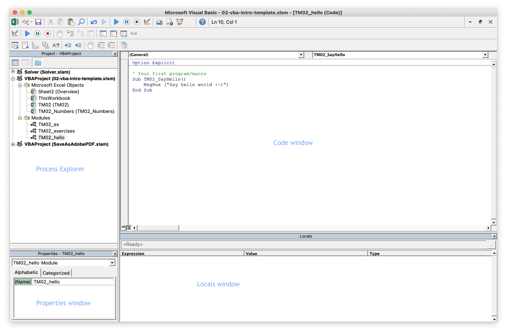

```{r, code = readLines("common.R"), cache = FALSE, include=FALSE}
```

```{r, include=FALSE}
module_number_prefix <- "02"
module_number <- as.numeric(module_number_prefix)
module_name <- "vba-intro"
here::i_am(str_c("book/", module_number_prefix, "_", module_name, ".Rmd"))
# module_name_underscore <- str_replace_all(module_name, "-", "_")
sheet_name_prefix <- str_c("TM", module_number)
```


# (PART) VBA {-}


# An introduction to VBA {#mod-vba-intro}

This module gives a short introduction to VBA, so you can get started programming and run your code.

```{r, echo=FALSE}
link_excel_file_text(module_number_prefix, module_name)
```

#### Learning path diagram {-}

Click/hover the nodes to follow links and see details.

```{r, echo=FALSE, out.width="100%", fig.asp=NA}
g <- create_learning_path(
   url = "https://docs.google.com/spreadsheets/d/1bBe42LHK-bE7CsU9eNBzi_7VNjbmv-Ybr7285pE61jM/edit?usp=sharing", 
   sheet = "vba-intro", 
   x_legend = NULL
)
render_graph(g, height = 300) 
```

If you like a different learning style there is a lot for videos about VBA online such as course [14-Hour VBA Course][vba-yt-course2]. The videos have been pointed out as online supplements in the learning path diagram. However, they are not necessary for the course. Since Excel change as new versions arrive and it work on different operating systems, the look in the screenshots and videos might be a bit different from your version. However, you still should be able to understand it. 

## Learning outcomes {#lo-vba-intro}

By the end of this module, you are expected to:

* Describe what VBA is.
* Setup Excel for VBA.
* Know how the macro recorder works.
* Make your first program.
* Have an overview over what VBA can do.
* Recorded you first macro using the macro recorder

The learning outcomes relate to the [overall learning goals](#lg-course) number 2 and 4 of the course.

<!-- SOLO increasing: identify · memorise · name · do simple procedure · collect data · -->
<!-- enumerate · describe · interpret · formulate · list · paraphrase · combine · do -->
<!-- algorithms · compare · contrast · explain causes · analyse · relate · derive · -->
<!-- evaluate · apply · argue · theorise · generalise · hypothesise · solve · reflect -->

## What is VBA {#vba-what}

Visual Basic for Applications (VBA) is an implementation of the BASIC programming language intended to control and automate Microsoft Office applications, developed by Microsoft. For instance, you can automatically create sheets, delete objects, create user-defined functions or read/write data to a sheet. It is not a standalone program, it can only run in the host application. In this course we will focus on running VBA from Excel. VBA is widely used in the industry (specially linked to Excel) and easy to learn. Microsoft stopped investing in VBA in 2008. It only update it for small changes. However, VBA is still a vital part of desktop Office applications, and will continue to be so in the future. 

VBA is a [compiled language](https://en.wikipedia.org/wiki/Compiled_language#:~:text=A%20compiled%20language%20is%20a,%2Druntime%20translation%20takes%20place) implemented using compilers (translators that generate machine code from source code). That is, code need to be compiled first before running it. You can only run VBA using the desktop version of Excel. That is, you can't create, run, or edit VBA in Excel for the web. 

With VBA you can extend Excel and automate tasks by coding different algorithms that for instance can be run by pressing a button. Since VBA is a programming language, the initial learning curve is steeper compared to Excel. However, you will get started fast because you already know Excel.


## Setup Excel for VBA {#vba-setup}

For running VBA code the **Developer** tab needs to be visible in Excel. This can be done by check marking the **Developer** tab under the 'Ribbon and Toolbar' options in Excel. You add it by choosing **Excel -> Preferences -> Ribbon and toolbar** (`r icons::fontawesome$brands$apple`) or right click a tab and choose **Customize ribbon ...** (`r icons::fontawesome$brands$windows`). 

```{r vba-editor, echo=FALSE, out.width="100%", fig.cap="The VBA editor."}

```

In the **Developer** tab you open the VBA editor by pressing the **Visual basic** button (`r icons::fontawesome$brands$windows` Alt + F11, `r icons::fontawesome$brands$apple` ⌥ + F11). The VBA editor is where you write your VBA code. A screenshot of the VBA editor can be seen in Figure \@ref(fig:vba-editor). You can setup the editor so it consists of a set of different sub-windows. Here we will highlight the ones you will use the most:

   * *Code*: The code window is where you can see the code of your modules. 
   * *Process Explorer*: Gives you an overview over all your open workbooks (a Excel file) and the VBA modules (a place to write VBA code) inside each workbook. 
   * *Properties*: Each element in the Process Explorer can be seen as an object and each object has a set of properties. For instance a module have a property called `Name` containing the name of the module. You can edit the name by modifying the field in the Properties window. Similar a worksheet has a set of properties (try selecting one of the sheets in the Process Explorer).
   * *Locals*: This is a window which can be used for debugging. During debugging you can run your code line by line by inserting breakpoints. You can then observe the values of your variables in the Locals window.
   
   <!-- * *Immediate*: This is a window which can be used for debugging (checking your code during development). Here you can output checks and run pieces of code. -->
   
If you do not see the sub-windows in the editor. Then you can open them using the icons in the toolbar (hoover over the icons to find them). Finally, let us set the preferences for the VBA editor. Open the preferences/options **Excel -> Preferences -> Editor** (`r icons::fontawesome$brands$apple`) or **Tools -> Options -> Editor** (`r icons::fontawesome$brands$windows`). Uncheck mark 'Auto Syntax Check' and check mark 'Require Variable Declaration'. 

  
## Your first program {#vba-hello}

Let us try to make your first piece of code. Download the template file `r link_excel_file(module_number_prefix, module_name)`, open the file and open the VBA editor under the **Developer** tab. 

   1) Add a new module by clicking the *Insert Module* icon (upper left corner - note you can hoover over the icons to see what they do).
   2) Rename the module (named *Module1*) to *`r str_c("TM", module_number, "_", "hello")`* (note you have to use underscores).
   3) Open the module by double clicking on the module in the Process Explorer 
   4) Add the code 
   
      ```
      ' Your first program/macro
      Sub TM2_SayHello()
          MsgBox ("Say hello world :-)")
      End Sub
      ```
      
      The code is a procedure (sub) and since it does not have any input arguments it is called a *macro* and can be run directly. Note if a line starts with a `'` then the line is considered as a comment and not used by the program.
   5) Run the macro by pressing the *Play* icon or using the shortcut F5. What happend?
   6) Go to the worksheet *`r sheet_name_prefix`* in Excel. 
      * In the **Developer** tab press the *Button* icon and click on cell G3. 
      * In the popup window select macro name *`r sheet_name_prefix`_SayHello* and click OK.
      * Rename the button by clicking the text and call it 'Say Hello'. Click besides the button to finish.
      * Run the button by clicking it.
      * Try right clicking the button and move/resize it.
   7) Save the workbook (Excel file). Note the Excel file has extension `.xlsm` and not `.xlsx` because it contains VBA code. 

You have now finished your first program by saying hello to the world using a message box.


## The macro recorder {#vba-macro}

It is possible to use the Macro recorder to turn your actions in Excel into VBA code. This can be particularly useful if you have forgotten the code for a specific color, the name of a function or need to plot a graph. Unfortunately, you cannot record if-statements or loops, so the recorder is not an easy way out of learning to code. But it is a handy tool for getting pieces of code. 

Let us try to record a macro that make a scatter plot of cells D8:E12 and change the title:

   1) Click the **Record Macro** icon under under the **Developer** tab.
   2) Name the macro *`r sheet_name_prefix`_Plot* and click OK (the recorder is now running).
   3) Go to the worksheet *`r sheet_name_prefix`* and select cells D8:E12.
   4) Add a scatter plot of the points.
   5) Rename the title to 'A line'.
   6) Click the **Stop Recording** icon under under the **Developer** tab.

You have now finished recording your macro. Let us have a look at the code by going to the ``r sheet_name_prefix`_Plot` sub in the VBA editor. You should have something similar to:

```
Sub TM2_Plot()
'
' TM2_Plot Macro
'
    Worksheets("TM2").Activate
    Range("D8:E12").Select
    ActiveSheet.Shapes.AddChart2(240, xlXYScatterSmooth).Select
    ActiveChart.SetSourceData Source:=Range("'TM2'!$D$8:$E$12")
    ActiveChart.ChartTitle.Select
    ActiveChart.ChartTitle.Select
    ActiveChart.ChartTitle.Text = "A line"
    Selection.Format.TextFrame2.TextRange.Characters.Text = "A line"
    With Selection.Format.TextFrame2.TextRange.Characters(1, 6).ParagraphFormat
        .TextDirection = msoTextDirectionLeftToRight
        .Alignment = msoAlignCenter
    End With
    With Selection.Format.TextFrame2.TextRange.Characters(1, 1).Font
        .BaselineOffset = 0
        .Bold = msoFalse
        .NameComplexScript = "+mn-cs"
        .NameFarEast = "+mn-ea"
        .Fill.Visible = msoTrue
        .Fill.ForeColor.RGB = RGB(89, 89, 89)
        .Fill.Transparency = 0
        .Fill.Solid
        .Size = 14
        .Italic = msoFalse
        .Kerning = 12
        .Name = "+mn-lt"
        .UnderlineStyle = msoNoUnderline
        .Spacing = 0
        .Strike = msoNoStrike
    End With
    With Selection.Format.TextFrame2.TextRange.Characters(2, 5).Font
        .BaselineOffset = 0
        .Bold = msoFalse
        .NameComplexScript = "+mn-cs"
        .NameFarEast = "+mn-ea"
        .Fill.Visible = msoTrue
        .Fill.ForeColor.RGB = RGB(89, 89, 89)
        .Fill.Transparency = 0
        .Fill.Solid
        .Size = 14
        .Italic = msoFalse
        .Kerning = 12
        .Name = "+mn-lt"
        .UnderlineStyle = msoNoUnderline
        .Spacing = 0
        .Strike = msoNoStrike
    End With
    ActiveChart.ChartArea.Select
End Sub
```

In general a recorded macro contains a lot of unnecessary code which can be removed. For instance, here we just want to make a scatter plot of cells D8:E12 and change the title. That is, the code can be reduced to:

```
' Add a scatter plot
Sub TM2_Plot()
    Worksheets("TM2").Activate
    Range("D8:E12").Select
    ActiveSheet.Shapes.AddChart2(240, xlXYScatterSmooth).Select
    ActiveChart.SetSourceData Source:=Range("'TM2'!$D$8:$E$12")
    ActiveChart.ChartTitle.Text = "A line"
End Sub
```

Which code to remove can sometimes be hard to realize. However, you may try to remove small parts of code, run the macro and check if the results still are as wanted.

Finally, try to add a button 'Make plot' that run the macro. Go to the worksheet *`r sheet_name_prefix`* and do steps:

   * In the **Developer** tab press the *Button* icon and click on cell G8. 
   * In the popup window select macro name *`r sheet_name_prefix`_Plot* and click OK.
   * Rename the button by clicking the text and call it 'Make plot'. Click besides the button to finish.
   * Run the button by clicking it.


## VBA - A short overview {#vba-overview}

Let us have a short overview over some VBA features so you can get started coding. Basic building blocks in programming are:

- _Variables_ store stuff in memory.
- _Procedures_ (functions and subs) execute a set of instructions.
- _Input and output_ are needed to read data and output the result.
- _Conditional statements_ are used to execute different instructions depending on a true/false value.
- _Loops_ are used to execute code repeatedly. 


### Variables

Variables are used to store information that is saved in memory. You may visualize a variable as a box in memory (see Figure \@ref(fig:vba-memory)). The variable name can be seen as the label on the box. 

```{r vba-memory, echo = FALSE, out.width="700px", fig.cap="Visualization of computer memory"} 
knitr::include_graphics("./img/storage.jpg") 
```

The box can contain for instance a number, a date or a boolean. That is, any data type defined by VBA. Some of the basic data types used by VBA are:

```{r, echo=FALSE}
dat <- tibble::tribble(
       ~Name,       ~Type,                                                                          ~Details,
      "Byte", "Numerical",                                                 "Whole number between 0 and 255.",
   "Integer", "Numerical",                                        "Whole number between -32768 and 32767.",
      "Long", "Numerical",                         "Whole number between - 2147483648 and 2147483647.",
    "Double", "Numerical", "Floating decimal number between -1.79769313486232E308 and 1.79769313486232E308.",
    "String",      "Text",                                                                           "Text.",
      "Date",      "Date",                                                                  "Date and time.",
   "Boolean",   "Boolean",                                                                  "True or False.",
   "Variant",  "Any type",                "Any kind of data (default type if the variable is not declared)."
   )
kbl(dat, caption = "Basic data types.") %>%
   kable_styling(bootstrap_options = c("striped", "hover", "condensed", "responsive"))  
```

All basic data types can be seen in the [VBA documentation](https://docs.microsoft.com/en-us/office/vba/language/reference/user-interface-help/data-type-summary).  Note that some data types are numericals, i.e. they represent a number (either an integer or a decimal number), other data types represent a set of characters (a string), a boolean or a date. 

More advanced data types such as a group of numbers (a numeric array), a range of cells in a worksheet (an object) or a set of numbers (a collection) will be considered in Module \@ref(mod-vba-datatypes).

Your memory contains a limited amount of storage and it is therefore important to use it wisely. The computer memory can be seen as a group of bits (zero and ones) and we can measure the memory size by counting the number of bits or bytes (8 bits = 1 byte). Different data types take up different amounts of memory. For example, the memory requirements for some of the basic data types are:

```{r, echo=FALSE}
dat <- tibble::tribble(
                                    ~"Data type",                        ~"Storage size",
                                        "Byte",                             "1 byte",
                                     "Boolean",                            "2 bytes",
                                     "Integer",                            "2 bytes",
                        "Long  (long integer)",                            "4 bytes",
   "Double  (double-precision floating-point)",                            "8 bytes",
                                        "Date",                            "8 bytes",
                                      "String", "10 bytes + string length * 2 bytes",
                         "Variant  (a number)",                           "16 bytes",
                         "Variant  (a string)", "22 bytes + string length * 2 bytes"
   )
kbl(dat, caption = "Memory requirements for some data types.") %>%
   kable_styling(bootstrap_options = c("striped", "hover", "condensed", "responsive")) %>% 
   footnote(general = "8 Bits = 1 Byte, 1024 Bytes = 1 Kilobyte, 1024 Kilobytes = 1 Megabyte, 1024 Megabytes = 1 Gigabyte and 1024 Gigabytes = 1 Terabyte.", general_title = "", footnote_as_chunk = T, fixed_small_size = T) 
```

<!-- Arrays require 20 bytes of memory plus 4 bytes for each array dimension plus the number of bytes occupied by the data itself. A Variant containing an array requires 12 bytes more than the array alone. -->

Always declare your variables explicit in VBA. If you can add `Option Explicit` in the top of your module, undefined variables will raise an error. You can add it by default by modifying the preferences for the VBA editor (see Section \@ref(vba-setup)). Declaring variables is good coding practice since it reduces the memory requirements and avoid type errors such as

```
Option Explicit

Dim intCtr as integer

intCtr = 10
intCtr = intCtg + 10
```

This will raise an error because `intCtg` is not defined (you have made a typo and meant `intCtr`). Without `Option Explicit` the code will run and assume that `intCtg` is another variable (initialized to zero). You declare variables using the `Dim` keyword:

```
'' Declare some variables
Sub TM03_DeclareVariables()
    ' Always declare variables in the top of a procedure (memory is allocated)
    Dim intPersons As Integer
    Dim dblAmount As Double
    Dim strText As String
    
    ' Here we assign values to the variables (modify the memory)
    intPersons = 10
    dblAmount = 27.4
    strText = "Number of persons are "
    
    MsgBox (strText & intPersons & " which own " & dblAmount & "$")
End Sub
```

Three variables are declared on the first three lines in the sub. Note variables can be of different data types (here an integer, a double and a string). We allocate values to the variables on the next lines and finally output the result in a message box. 


### Procedures 

In VBA we deal with two kinds of procedures: A `Sub` which can work as a “macro” in Excel, i.e. we can call it using e.g. a button and a `Function` which can work like Excel functions, i.e. return a value. We already have declared some subs. Let us try to make a function:

```
'' A function joining two strings
Function TM2_StringJoin(strF As String, strL As String) As String
    Dim strJ As String
    strJ = strF & " " & strL
    TM2_StringJoin = strJ
End Function
```

First observe that the function have two string input arguments `strF` and `strL`. These two strings are joined into one string (saved in the variable `strJ`) by using the string concatenate symbol `&`. Finally, the value is returned by assigning the value to same variable as the function name `TM2_StringJoin`. The function can be called from Excel like any other function by using the function name (have a look at cell D5 in the worksheet *`r sheet_name_prefix`*). 

You may also use all the built-in Excel functions in VBA:

```
'' Call an Excel function
Sub TM2_ExcelFunction()
    MsgBox ("The sum of cells D9:D12 are " & WorksheetFunction.Sum(Worksheets("TM2").Range("D9:D12")))
End Sub
```

Note all Excel functions are accessed using the `WorksheetFunction` object. That is, we write `WorksheetFunction.<function name>`. VBA also has a set of [built-in functions](https://www.techonthenet.com/excel/formulas/index_vba.php) which can be used. For instance the `Date` and `InStr` function:

```
'' Call VBA functions (run it using F5)
Sub TM2_VBAFunction()
    MsgBox ("The current date is " & Date)
    MsgBox ("Jen is found at char number: " & InStr("Hi Jen how are you", "Jen"))
End Sub
```

We will have a closer look on procedures in Module \@ref(mod-vba-procedures).


### Input and output

Input and output are needed to read data and output the result. Examples on input/output are dialog boxes which can be created using `MsgBox` or `InputBox`:

```
Sub TM2_Dialog()
    Dim strName As String

    strName = InputBox("Type your name:")
    MsgBox "Your name is " & strName
End Sub
```

First, a string is declared. Next, a value is read to the string using an input box. Finally, the result is output using a message box.

You can also write/read values from a sheet using `Range` or `Cells`. Note it is always a good idea to know which sheet you are considering by using the `Worksheets` function:

```
'' Read and write to sheet
Sub TM2_ReadWriteSheet()
    Dim str1 As String
    Dim int1 As Integer
    
    Worksheets("TM2").Activate  ' We activate a sheet so know use this sheet
    ' Input values from sheet
    str1 = Range("D4")  ' read cell D4
    int1 = Cells(9, 4)  ' read row 9 and col 4 (cell D9)
    ' Output values
    Range("B7") = str1 & "(" & int1 & ")"
    Cells(8, 2) = str1
End Sub
```

After declaring variables, the worksheet `r sheet_name_prefix` is activated and we input/output values using the `Range` and `Cells` functions. We will have a closer look on the range object in Module \@ref(mod-vba-datatypes).


### Conditional statements

Conditional statements execute different instructions depending on a true/false value.

```
'' Conditional statements example
Sub TM2_CondStatement()
    Dim strName As String
    Dim intAnswer As Integer
    
    Worksheets("TM2").Activate
    strName = InputBox("Type your name:")
    intAnswer = MsgBox("Do you want to display your name in a message box?", vbYesNo)  ' you can use vbYes and vbNo in your code
    If intAnswer = vbYes Then
        ' Make the message box:
        MsgBox ("Your name is " & strName)
    Else
        ' Write to the sheet:
        Range("B10") = strName
        MsgBox ("Your name is in cell B10")
    End If
End Sub
```

After declaring variables and activating the worksheet, a dialog box is used for reading your name. Next, based on your answer we use an `If`/`Else` statement to do two different tasks. We will have a closer look on conditional statements in Module \@ref(mod-vba-loops-cond).


### Loops

Loops can be used to execute code repeatedly:

```
'' Loops example
Sub TM2_Loops()
    Dim k As Integer
    
    Worksheets("TM2").Activate
    For k = 2 To 5
        Cells(k, 10) = "Row " & k
    Next
End Sub
```

Here a `For` loop is used to write out values to cells J2:J5. We will have a closer look on loops in Module ??.


<!-- ## An example -->

## Good coding pratice {#vba-coding-practice}

It is always a good idea to maintain a consistent coding practice. The main reason for using a consistent set of coding conventions is to standardize the structure and coding style of an application so that you and others can easily read and understand the code. Good coding conventions result in precise, readable, and unambiguous source code that is consistent with other language conventions and as intuitive as possible. 

As you already have seen the code in this teaching module has been structured in VBA modules (we use the prefix `r str_c(sheet_name_prefix, "_")` for all modules related to this teaching module). Each procedure starts with a capital letter and we use code indention to read the code easier. 

Different ways of naming variables exists (naming convention). Some use [snake case][wiki-snake-case] others use [camel case][wiki-camel-case]. The [Leszynski naming convention](https://en.wikipedia.org/wiki/Leszynski_naming_convention) define variables with a consistent prefix that makes it easy to identify its data type. Some common prefixes used for the Leszynski naming convention are:

```{r, echo=FALSE}
dat <- tibble::tribble(
                  ~"Type", ~"Prefix", ~"Example",
                "Boolean", "bln", "blnFound",
             "Currency", "cur", "curRevenue",
               "Date (Time)", "dtm<", "dtmStart",
              "Double", "dbl", "dblTolerance",
             "Integer", "int", "intQuantity",
             "Long", "lng", "lngDistance",
                "String", "str", "strFName",
             "Variant", "vnt", "vntCheckSum",
             "Array", "ary", "aryNumbers (optional)",
            "Worksheet", "wst", "wstDistances",
                 "Workbook", "wbk", "wbkData"
   )
kbl(dat, caption = "Prefixes for some variables.") %>%
   kable_styling(bootstrap_options = c("striped", "hover", "condensed", "responsive")) 
```


Many [other prefixes](https://msdn.microsoft.com/en-us/library/aa263493(v=vs.60).aspx) can be used also. It is common to use Leszynski convention within the VBA community. A few examples:

```
this_is_snake_case   # note you do not use capital letters here (not used)
thisIsCamelCase      # you start each word with a capital letter (except the first)
intAmount            # Lezynski convention naming an integer (int) variable
strFullName          # Lezynski naming a string (str) variable
```

We adapt the Leszynski naming convention together with camel case. One exception is that we add the suffix `TM2_` when we name procedures so that we can easy find procedures related to a given teaching module. When defining variables and functions, it is in general good practice to use nouns for variables and verbs for functions.

It is always good practice to comment your code. Such that others can get a fast overview and understand your code easier. We will use [roxygen documentation](https://roxygen2.r-lib.org/) comments which are widely known. For example in the top of a module file you may write:

```
'' Module description.
'  Can be more than one line.
' @author Lars Relund <junk@relund.dk>
```

Before each `sub`, `function` etc. write something like:

```
'' Sub description
' 
' @pre Precondition 
' @post Postcondition
'
' @param strA	Explanation of input parameter strA
' @param intB Explanation of input parameter intB
' @return Return value (if a function)
' @remarks Further remarks 
Function MyFunc(strA As String, intB As Integer) As Integer {
   ...
}
```

For further details about coding/naming convention see Section \@ref(coding-convention).


## Recap {#rc-vba-intro}

This module gives a short introduction to VBA which is: 

- A programming language intended to control and automate Microsoft Office applications (we use Excel).
- VBA (Visual Basic for Applications) is an implementation of BASIC developed by Microsoft. 
- A [compiled language](https://en.wikipedia.org/wiki/Compiled_language#:~:text=A%20compiled%20language%20is%20a,%2Druntime%20translation%20takes%20place). That is, code need to be compiled first before running it. 
- You can only run VBA using the desktop version of Excel (not the web version).
- With VBA you can extend Excel and automate tasks by coding different algorithms that for instance can be run by pressing a button. 

For running VBA code the **Developer** tab needs to be visible in Excel. This can be done by check marking the **Developer** tab under the 'Ribbon and Toolbar' options in Excel. You add it by choosing **Excel -> Preferences -> Ribbon and toolbar** (`r icons::fontawesome$brands$apple`) or right click a tab and choose **Customize ribbon ...** (`r icons::fontawesome$brands$windows`).

In the **Developer** tab you open the VBA editor by pressing the **Visual basic** button (`r icons::fontawesome$brands$windows` Alt + F11, `r icons::fontawesome$brands$apple` ⌥ + F11).

A few useful shortcuts:

- Toggle VBA editor and Excel (`r icons::fontawesome$brands$windows` Alt + F11, `r icons::fontawesome$brands$apple` ⌘⇧´).
- Run current procedure or continues execution after pausing (F5).
<!-- - Terminate a procedure and reset all variables to their default values (Shift + F5). -->
- Auto complete code (Ctrl + Space). On a mac you may have to disable the default shortcut (Ctrl + Space) for switching input sources. You can go to the System Preferences -> Keyboard -> Shortcuts -> Input Sources and disable it.
- Use the debugger and go to next line of code (`r icons::fontawesome$brands$windows` F8, `r icons::fontawesome$brands$apple` ⇧⌘I).
<!-- - Open the Object Browser (F2). -->
- Switch between subs/functions (`r icons::fontawesome$brands$windows`  Ctrl + Up/Down, `r icons::fontawesome$brands$apple` ⌘ + Up/Down).
<!-- - Run Debugger to this line (Ctrl + F8). -->

Basic building blocks in programming:

- _Variables_ store stuff in memory.
- _Procedures_ (functions and subs) execute a set of instructions.
- _Conditional statements_ (decisions) are used to execute different instructions depending on a true/false statement.
- _Loops_ are used to execute code repeatedly. 
- _Input/output_ are needed to read data and output the result.

Variables are used to store information in the program. Think of it as a box that can contain e.g. a number, a string or and array of integers. The variable name is the label on the box.

In VBA we deal with two kinds of procedures: A `Sub` which can work as a “macro” in Excel, i.e. we can call it using e.g. a button and a `Function` which can work like Excel functions, i.e. return a value.

Examples on input/output are dialog boxes which can be created using `MsgBox` or `InputBox`. You can also write/read values from a sheet using `Range` or `Cells`. Note it is always a good idea to know which sheet you are considering use the `Worksheets` function.

Conditional statements (decisions) execute different instructions depending on a true/false. 

Loops can be used to execute code repeatedly.

Excel functions can be called with the `WorksheetFunction` e.g. `WorksheetFunction.Sum(Range("D2:E5"))`

Always remember to save workbooks with VBA code using the file has extension `.xlsm` and not `.xlsx` otherwise the VBA code will be removed from the file! 

You may also have a look at the [slides for this module](https://bss-osca.github.io/tfa/slides/01-01_vba-intro-slides.html).

## Exercises {#ex-vba-intro}

`r strExercises`

```{r, echo=FALSE}
link_excel_file_text(module_number_prefix, module_name)
```

### Exercise - Hello {#ex-vba-hello}

Consider the procedure ``r sheet_name_prefix`_SayHello` in Section \@ref(vba-hello) and modify it into procedure ``r sheet_name_prefix`_SayHelloAdv` with features: 
 
   (1) Use an input box to ask for your name.
   (2) Output *Hello <your name>* in cell B11 in worksheet *`r sheet_name_prefix`*.
   (3) Run it using the shortcut F5. 


### Exercise - Record a macro {#ex-vba-macro}
   
Do the following steps:

   (1) Type 'My name is:' in cell B12. 
   (2) Type you name in cell B13 and activate it (click on it).
   (3) Start the macro recorder and call the macro ``r sheet_name_prefix`_ChangeLayout`.
   (4) Change the color to blue and font size to 14.
   (5) Stop the macro recorder.
   (6) Activate cell B12 and run the macro.
   (7) Open the VBA editor and inspect the macro. 
   (8) Cleanup the macro so only stuff about color and size are maintained.
   (9) Add a button to run the macro.
   (10) Select cells D15:E17 and run the macro.
   (11) Modify the macro in the editor so the font size is 10 and test it.


### Exercise - User input {#ex-vba-user-input}

Write a procedure (sub) ``r sheet_name_prefix`_CheckNumber` that:

   (1) Ask for an integer using an input box.
   (2) Make a message box telling if the number is above or at most 10.
   (3) Write the number to cell B14.
   (4) What happens if you do type in a string in the input box?


### Exercise - Max and min number {#ex-vba-max-min}

The worksheet *`r sheet_name_prefix`_Numbers* contains a button to a procedure that generate 40 random numbers.

<!-- Q1 -->
```{r, hint=TRUE, eval=FALSE}
Sub TM2_FindMax()
    Dim intM As Integer
    Dim r As Integer
    
    Worksheets("TM2_Numbers").Activate
    intM = 0
    For r = 1 To 40
        If Cells(r, 1) ___ intM Then
            intM = ___
        End If
    Next
    Range("D1") = ___
End Sub
```

   (1) Create a procedure that use loops and conditional statements to find the maximum number and write it to cell D1. Assign the procedure to button _Find max_.
   (2) Create a procedure that use loops and conditional statements to find the minimum number and write it to cell D2. Assign the procedure to button _Find min_.
   
   
<!-- Q3 -->
```{r, hint=TRUE, eval=FALSE}
Sub TM2_FindRange()
    Dim intM1 As Integer
    Dim intM2 As Integer
    Dim r As Integer
    
    Worksheets("TM2_Numbers").Activate
    intM1 = 1001
    intM2 = 0
    For r = 1 To 40
        ___
    Next
    Range("D3") = "[" & intM1 & "," & intM2 & "]"
End Sub
```
   
   (3) Create a procedure that use loops and conditional statements to find the number range and write it to cell D3. Assign the procedure to button _Find range_. Given two numbers `m1` and `m2`, you can concatenate them to a string using `&` e.g. `"[" & m1 & "," & m2 & "]"`.
   (4) Create a procedure that use loops and conditional statements to count the number of positives and write it to cell D4. Assign the procedure to button _Count positives_.
   
It may often be nice to know the row number of the minimum and maximum values.

   (5) Create a procedure that finds the maximum row number and write it to cell D5. Assign the procedure to button _Find max row_.
   (6) Create a procedure that finds the minimum row number and write it to cell D6. Assign the procedure to button _Find min row_.
   
The procedure ``r sheet_name_prefix`_RunAll` which is already linked to button _Run All_, runs all the procedures. Have a look at the code and try it out.


```{r links, child="links.md", include=FALSE}
```

<script src="//unpkg.com/@highlightjs/cdn-assets@11.5.1/highlight.min.js"></script>
<script type="text/javascript" src="https://unpkg.com/highlightjs-vba/dist/vba.min.js"></script>
<!-- <script src="//cdnjs.cloudflare.com/ajax/libs/highlightjs-line-numbers.js/2.8.0/highlightjs-line-numbers.min.js"></script> -->
<script type="text/javascript">
  hljs.initHighlightingOnLoad();
  // hljs.initLineNumbersOnLoad({singleLine: true}); 
</script> 