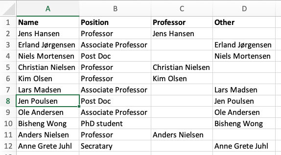

```{r, code = readLines("common.R"), cache = FALSE, include=FALSE}
```

```{r, include=FALSE}
module_number_prefix <- "03"
module_number <- as.numeric(module_number_prefix)
module_name <- "vba-loops-cond"
here::i_am(str_c("book/", module_number_prefix, "_", module_name, ".Rmd"))
# module_name_underscore <- str_replace_all(module_name, "-", "_")
sheet_name_prefix <- str_c("TM", module_number)
```

# Loops and conditional statements {#mod-vba-loops-cond}

This module gives an introduction to loops and conditional statements. Loops are used to repeat code and conditional statements are used to redirect code execution based on the conditions. Both are basic building blocks in programming.

```{r, echo=FALSE}
link_excel_file_text(module_number_prefix, module_name)
```
 
#### Learning path diagram {-}

Click/hover the nodes to follow links and see details.

```{r, echo=FALSE, out.width="100%", fig.asp=NA}
g <- create_learning_path(
   url = "https://docs.google.com/spreadsheets/d/1bBe42LHK-bE7CsU9eNBzi_7VNjbmv-Ybr7285pE61jM/edit?usp=sharing", 
   sheet = "vba-loops-cond",
   x_legend = NULL)
render_graph(g, height = 220)
```

If you like a different learning style there is a lot for videos about VBA online such as course [14-Hour VBA Course][vba-yt-course2]. The videos have been pointed out as online supplements in the learning path diagram. However, they are not necessary for the course. Since Excel change as new versions arrive and it work on different operating systems, the look in the screenshots and videos might be a bit different from your version. However, you still should be able to understand it. 

## Learning outcomes {#lo-vba-loops-cond}

By the end of this module, you are expected to be able to:

* Describe what a conditional statement is.
* Test a condition built using relational/logical operators.
* Declare a conditional statement.
* Describe what a loop is.
* Declare a loop.
* Declare nested loops.
* Exit a loop.

The learning outcomes relate to the [overall learning goals](#lg-course) number 1, 2, 4, 8, 9-12 and 16 of the course.

<!-- SOLO increasing: identify · memorise · name · do simple procedure · collect data · -->
<!-- enumerate · describe · interpret · formulate · list · paraphrase · combine · do -->
<!-- algorithms · compare · contrast · explain causes · analyse · relate · derive · -->
<!-- evaluate · apply · argue · theorise · generalise · hypothesise · solve · reflect -->


## Relational and logical operators {#vba-operators}

Often you will need to compare a variable with another one. For this you need the *relational operators* given in Table \@ref(tab:comp-ope) (also called comparison operators).

```{r comp-ope, echo=FALSE}
dat <- tibble::tribble(
    ~Operator,                                                                                                                              ~Description,             ~Example,
          "=", "Equal to.",                 "A = B ' False",
         "<>", "Not equal to",              "A <> B ' True",
          ">", "Greater than.",             "A > B ' False",
          "<", "Less than.",                "A < B ' True",
         ">=", "Greater than or equal to.", "A < B ' True",
         "<=", "Less than or equal to.",    "A <= B ' True"
   )
kbl(dat, caption = "Comparison/relational operators.") %>%
   kable_styling(bootstrap_options = c("striped", "hover", "condensed", "responsive")) %>% 
   footnote(general = "Assume that A = 2 and B=4.", general_title = "", footnote_as_chunk = T, fixed_small_size = T) 
```

Let us consider an example (try to guess the output before running the procedure):

```
'' Comparison of two variables
Sub TM3_Comparison()
   Dim intA As Integer
   Dim intB As Integer

   intA = 10
   intB = 20
   
   If intA = intB Then
      MsgBox ("A = B is True")
   Else
      MsgBox ("A = B is False")
   End If
   
   If intA <> intB Then
      MsgBox ("A not equal B is True")
   Else
      MsgBox ("A not equal B is False")
   End If

   If intA > intB Then
      MsgBox ("A greter then B is True")
   Else
      MsgBox ("A greter then B is False")
   End If

   If intA <= intB Then
      MsgBox ("A less than or equal to B is True")
   Else
      MsgBox ("A less than or equal to B is False")
   End If
End Sub
```

Given two boolean expressions we use *logical operators* to compare them (see Table \@ref(tab:logi-ope)) 

```{r logi-ope, echo=FALSE}
dat <- tibble::tribble(
   ~Operator,  ~Description,    ~Example,
   "AND", "If both the conditions are True, then the expression is true.", "A<>0 AND B<>0 ' False",
   "OR",  "If any of the two conditions are True, then the expression is true.", "A<>0 OR B<>0 ' True",
   "NOT", "Reverse logical: if the expression is true, then the NOT operator returns false.", "NOT(A<>0 OR B<>0) ' False",
   "XOR", "Logical Exclusion. If exactly one condition is True, the result is True.", "A<>0 XOR B<>0 ' True"
)
kbl(dat, caption = "Logical operators.") %>%
   kable_styling(bootstrap_options = c("striped", "hover", "condensed", "responsive")) %>% 
   footnote(general = "Assume that A = 0 and B=4.", general_title = "", footnote_as_chunk = T, fixed_small_size = T) 
```

Let us consider an example (try to guess the output before running the procedure):

```
Sub TM3_Logical()
    If 5 > 4 And 6 > 2 Then
        MsgBox ("5 > 4 And 6 > 2 is True")
    Else
        MsgBox ("5 > 4 And 6 > 2 is False")
    End If
    
    If 1 > 4 Or 1 > 2 Then
        MsgBox ("1 > 4 Or 1 > 2 is True")
    Else
        MsgBox ("1 > 4 Or 1 > 2 is False")
    End If
    
    If 6 > 4 Or 1 > 2 Then
        MsgBox ("6 > 4 Or 1 > 2 is True")
    Else
        MsgBox ("6 > 4 Or 1 > 2 is False")
    End If
    
    If 5 > 4 And Not 6 > 2 Then
        MsgBox ("5 > 4 And Not 6 > 2 is True")
    Else
        MsgBox ("5 > 4 And Not 6 > 2 is False")
    End If
    
    ' If more than two boolean expressions remember parenthesis
    If (5 > 4 Xor 6 > 2) And 7 > 10 Then   ' Xor (exactly one is true)
        MsgBox ("(5 > 4 Xor 6 > 2) And 7 > 10 is True")
    Else
        MsgBox ("(5 > 4 Xor 6 > 2) And 7 > 10 is False")
    End If
    
    If 5 > 4 Xor (6 > 2 And 7 > 10) Then
        MsgBox ("5 > 4 Xor (6 > 2 And 7 > 10) is True")
    Else
        MsgBox ("5 > 4 Xor (6 > 2 And 7 > 10) is False")
    End If
End Sub
```

Note parentheses have an impact on the result. Remember to use them correctly. 


## Loops {#vba-loops}

Loops are used to repeat pieces of code. There are many types of loops statements but here we will consider `For` and `While` loops. The structure of a `For` loop is:

```
For i = 1 To 10 
    <code>
Next
```

Here `i` is a counter used to repeat the code inside the loop 10 times. In general we do not use a suffix for counter variables (`i` should have been named `intI` according to our naming convention). An example on a simple for loop is:

```
Sub TM3_Loop1()
    Dim i As Integer
    
    For i = 1 To 3
        MsgBox (i) ' What will the output be?
    Next
End Sub
```

You can use the `Step` keyword to increment the counter by more than one:

```
Sub TM3_Loop2()
    Dim i As Integer
    
    For i = 2 To 9 Step 2
        If i <> 4 Then
            MsgBox (i) ' What will the output be?
        End If
    Next
End Sub
```

You can use `Exit For` to end a for loop prematurely (jump to the code after the loop):

```
'' Write the row number in column A and exit after row 10 even though the loop runs to 20
Sub TM3_WriteNumbers1()
   Dim r As Integer
   
   Worksheets("TM3").Activate  ' activate the sheet we want to use
   For r = 6 To 20
      If r > 10 Then
         Exit For
      End If
      Cells(r, 1) = r  ' write to row r, col 1 (A)
   Next
End Sub
```

Loops may be nested inside each other. For instance if some action needs to be performed for each day and each employee or for each project and each work package of that project.

```
Sub TM3_NestedLoops()
    Dim i As Integer
    Dim j As Integer
    
    For i = 1 To 2
        For j = 1 To 3
            MsgBox ("(" & i & "," & j & ")")
        Next
    Next
End Sub
```

The structure of a `While` loop is:
      
```
Do While <condition true>  
    <code>
Loop
```

Here the loops runs until the condition is not true. While loops are useful when you do not know how many times to do the loop in advance. An example on a simple while loop is:

```
'' Write the row number in column B and exit after row 10
Sub TM3_WriteNumbers2()
    Dim r As Integer
    
    Worksheets("TM3").Activate
    r = 6
    Do While r < 11
        Cells(r, 2) = r ' write to row r, col 2 (B)
        r = r + 1
    Loop
End Sub
```

You can use `Exit Do` to end a while loop prematurely (jump to the code after the loop):

```
'' Write 2, 4, ... in column C and exit after 21 or if equals 12
Sub TM3_WriteNumbers3()
    Dim i As Integer, r As Integer
    
    Worksheets("TM3").Activate
    r = 6
    i = 2
    Do While i < 21
        Cells(r, 3) = i ' write to row r, col 3 (C)
        If i = 12 Then
            Exit Do
        End If
        r = r + 1
        i = i + 2
    Loop
End Sub
```

Beware of endless loops. If the stopping criteria is NOT reached when using a while loop, the computer will keep going:

```
' An endless loop. Do not run if you don't know how to stop
Sub TM3_EndlessLoop()
    Dim i As Integer
    While i >= 0
        i = i + 1
    Wend
End Sub
```

An endless loop can be hard to stop depending on the operating system you use. Therefore always “save” before you “run” the code. Make sure the stopping criterion will be reached. You may try to stop the program using a shortcut (`r icons::fontawesome$brands$windows` try Ctrl + Break or Ctrl + Alt + Delete. `r icons::fontawesome$brands$apple` try ⌘., ⌃ +  Esc or  ⌘⌥ + Esc.)

Finally, the `For Each` loop has to be mentioned:

```
Sub TM3_ForEach()
   Dim rngC As Range
   Dim i As Integer
   
   Worksheets("TM3").Activate
   i = 1
   For Each rngC In Range("D6:E9")
      rngC = i
      i = i + 1
   Next
End Sub
```

The loop is used for running trough a set of objects (we will have a closer look at objects in Section \@ref(vba-objects)). Here `rngC` is used to run through all the cells in the range and set values. Note a range is scanned left-down.


## Conditional statements {#vba-cond}

Conditional statements are used to redirect code execution based on the conditions. If the condition is met then the code is executed. The general layout of an if-then-else conditional statement is:

```
If <condition> Then
 <code>
ElseIf <condition> Then
 <code>
ElseIf <condition> Then
 <code>
Else
 <code>
End If

If <condition> Then <code> Else <code>  ' single line form
```

You can drop the `ElseIf` and `Else` code chunks. Other conditional statements exists but in general you can formulate them using an if-then-else statement. Let us try to use a conditional statement to separate persons in two groups:

```
'' Seperate persons into two groups (names are written in 2 columns)
Sub TM3_SeparatePersons1()
    Dim r As Integer
    
    Worksheets("TM3_Separate1").Activate ' activate the correct sheet
    For r = 2 To 12 ' scan rows 2-12
        If Cells(r, 2) = "Professor" Then
            Cells(r, 3) = Cells(r, 1)  ' output in row C
        Else
            Cells(r, 4) = Cells(r, 1)  ' output in row D
        End If
    Next
End Sub
```

We use variable `r` to store the row number we want to write to and then an if statement to separate professors from others. The output will be:

```{r sep-2, echo = FALSE, out.width="400px", fig.cap="Separate into two groups."} 
 
```

If you want to separate both professors and associate professors from others, you may modify the if statement and use an `ElseIf`:

```
'' Seperate persons into 3 groups (names are written in 3 columns)
Sub TM3_SeparatePersons2()
    Dim r As Integer
    
    Worksheets("TM3_Separate2").Activate ' activate the correct sheet
    For r = 2 To 12
        If Cells(r, 2) = "Professor" Then
            Cells(r, 3) = Cells(r, 1)
        ElseIf Cells(r, 2) = "Associate Professor" Then
            Cells(r, 4) = Cells(r, 1)
        Else
            Cells(r, 5) = Cells(r, 1)
        End If
    Next
End Sub
```

Finally, let us try to separate into five groups: 

```
'' Seperate persons into 5 groups (names are written in 5 columns)
Sub TM3_SeparatePersons3()
    Dim r As Integer
    
    Worksheets("TM3_Separate3").Activate ' activate the correct sheet
    For r = 2 To 12
        If Cells(r, 2) = "Professor" Then
            Cells(r, 3) = Cells(r, 1)
        ElseIf Sheet1.Cells(r, 2) = "Associate Professor" Then
            Cells(r, 4) = Cells(r, 1)
        ElseIf Sheet1.Cells(r, 2) = "Post Doc" Then
            Cells(r, 5) = Cells(r, 1)
        ElseIf Sheet1.Cells(r, 2) = "PhD student" Then
            Cells(r, 6) = Cells(r, 1)
        Else
            Cells(r, 7) = Cells(r, 1)
        End If
    Next
End Sub
```

Here the output will be:

```{r sep-5, echo = FALSE, out.width="600px", fig.cap="Separate into five groups."} 
knitr::include_graphics("./img/sep-persons-3.png") 
```


## Example - Find Jen {#vba-ex-jen}

Consider column A in Figure \@ref(fig:sep-5). Assume we want to check if Jen is in a name and output her position. We can use a for loop for this:

```
'' Find cell with Jen using a For loop
Sub TM3_FindJen1()
    Dim r As Integer
    
    Worksheets("TM3_Separate1").Activate ' activate the correct sheet
    For r = 2 To 12
        If InStr(Cells(r, 1), "Jen ") > 0 Then  ' InStr returns first char position at which match is found (0 if no match)
            MsgBox "Jen is a " & Cells(r, 2) & " (Row " & r & ")"
            Exit For   ' exit the loop
        End If
    Next
End Sub
```

We scan all rows for Jen and return her position. If we found her, then we exit the for loop (no need to search further). What happens if we search for `"Jen"` and not `"Jen "`? 

```{r jen1, echo = FALSE, out.width="300px", fig.cap="Search for Jen."} 
knitr::include_graphics("./img/tm3-jen.png") 
```
 
The same can be done using a while loop:

```
'' Find cell with Jen using a While loop
Sub TM3_FindJen2()
    Dim r As Integer
    
    r = 2
    Do While InStr(Cells(r, 1), "Jen ") = 0
        r = r + 1
    Loop
    MsgBox "Jen is a " & Cells(r, 2) & " (Row " & r & ")"
End Sub
```

Beware of endless looping here. What happens if Jen is not present in column A? A more error safe while loop is:

```
'' Find cell with Jen using a While loop and better stopping criteria
Sub TM3_FindJen3()
    Dim r As Integer
    
    r = 2
    Do While InStr(Cells(r, 1), "Jen ") = 0 And r < 13
        r = r + 1
    Loop
    If (r = 13) Then
        MsgBox ("Jen not found")
    Else
        MsgBox "Jen is a " & Cells(r, 2) & " (Cell A" & r & ")"
    End If
End Sub
```


## Example - A distance matrix {#vba-ex-dist-mat}

Assume that you have a set of $n=10$ locations: 

```{r, echo=FALSE}
dat <- tibble::tribble(
   ~"Location number", ~"$x$-coordinate", ~"$y$-coordinate",
        1L, 6L, 1L,
        2L, 1L, 5L,
        3L, 6L, 3L,
        4L, 7L, 4L,
        5L, 4L, 6L,
        6L, 4L, 7L,
        7L, 5L, 2L,
        8L, 1L, 4L,
        9L, 4L, 2L,
       10L, 6L, 5L
   )
kbl(dat, caption = "A set of locations", align="c") %>%
   kable_styling(bootstrap_options = c("striped", "hover", "condensed", "responsive"), full_width = F) 
```

The euclidean distance $d$ between location $l_1 = (x_1, y_1)$ and $l_2 = (x_2, y_2)$ are: $$d(1,2)=\sqrt{(x_1-x_2)^2 + (y_1-y_2)^2}.$$ In VBA the function becomes:

```
'' Calculate distance between two points
'
' @param x1 x-coordinate of first point.
' @param y1 y-coordinate of first point.
' @param x2 x-coordinate of second point.
' @param y2 y-coordinate of second point.
Private Function TM3_Distance(x1, y1, x2, y2)
    Dim x As Double
    Dim y As Double
    
    x = x1 - x2
    y = y1 - y2
    TM3_Distance = Sqr((x * x) + (y * y))
End Function
```

Assume that you want to calculate the *distance matrix* $D$ where entry $(i,j)$ contains the distance between location $i$ and location $j$.

Consider the locations in columns B and C:

```{r dist-mat, echo = FALSE, out.width="100%", fig.cap="Distance matrix worksheet."} 
knitr::include_graphics("./img/dist-mat.png") 
```

We want to fill out the cells F1:P11 with the distances. This have been done using procedure:

```
'' Create a distance matrix starting in column 6
'
' @pre Assume that coordinates are stored in column B and C starting from row 2
'      and that number of points are stored in E1.
Public Sub TM3_MakeDistanceMatrix()
    Dim n As Integer
    Dim i As Integer
    Dim j As Integer
      
    n = Range("E1")
    For i = 1 To n  ' add row and column headers
        Cells(i + 1, 6) = Cells(1 + i, 1) ' row equals i+1
        Cells(1, 6 + i) = Cells(1 + i, 1) ' column equals i+6
    Next
    
    ' add distances
    For i = 1 To n
        For j = 1 To n
           Cells(i + 1, j + 6) = TM3_Distance(Cells(i + 1, 2), Cells(i + 1, 3), Cells(j + 1, 2), Cells(j + 1, 3))
        Next
    Next
End Sub
```

First, row and column headers are written to the cells. Next, we use a nested for loop to calculate the distances and output them to the cells. Note we in fact calculate the same distance two times (the distance from $i$ to $j$ equals the distance from $j$ to $i$). Since we have symmetric distances there is no need to do this and it can be avoided by letting the inner loop in the nested loops be dependent on the outer loop: 

```
'' Create a symetric distance matrix with only the upper right part filled starting in column 6.
'
' @pre Assume that coordinates are stored in column B and C starting from row 2
'      and that number of points are stored in E1.
Public Sub TM3_MakeSymetricDistanceMatrix()
    Dim n As Integer
    Dim i As Integer
    Dim j As Integer
      
    n = Range("E1")
    For i = 1 To n
        Cells(i + 1, 6) = Cells(1 + i, 1)
        Cells(1, 6 + i) = Cells(1 + i, 1)
    Next
    
    For i = 1 To n
        For j = i + 1 To n
           Cells(i + 1, j + 6) = TM3_Distance(Cells(i + 1, 2), Cells(i + 1, 3), Cells(j + 1, 2), Cells(j + 1, 3))
        Next
    Next
End Sub
```

```{r dist-mat-sym, echo = FALSE, out.width="100%", fig.cap="Distance matrix worksheet with symmetric distances."} 
knitr::include_graphics("./img/dist-mat-sym.png") 
```


## Recap

- Loops are used to repeat pieces of code.
- For loops (repeat a number of times):
  ```
  For i = 1 To 10 
      <code>
  Next
  ```
      
- While loops (repeat until a condition is met):

   ```
   Do While <condition> ' repeat while true     
       <code>
   Loop
   ```
      
- Use `Exit for` and `Exit Do` to break a `For` and a `Do While` loop before it ends (jump to the code after the loop). 
- Loops may be nested inside each other:

   ```
   For i = 1 To 2     
     For j = 1 To 3  
         MsgBox ("(" & i & "," & j & ")")
     Next
   Next
   ```
   
- Conditional Statements are used to make decisions based on the conditions. If the condition is met then the code is executed. 
- An if-then-else statement: 

   ```
   If <condition> Then
    <code>
   ElseIf <condition> Then
    <code>
   Else
    <code>
   End If
   ```
   
   You may drop the `ElseIf` and `Else` code chunks. 

You may also have a look at the [slides for this module](https://bss-osca.github.io/tfa/slides/02-03_vba-loops-cond-slides.html).

## Exercises {#ex-vba-loops-cond}

`r strExercises`

```{r, echo=FALSE}
link_excel_file_text(module_number_prefix, module_name)
```

### Exercise - Loops {#ex-vba-loops}

Use the sheet _TM3_ for output.

   (1) Create a for loop that writes numbers 1 to 4 in rows 25 to 28 in column A.  
   (2) Create a do while loop that writes numbers 1 to 4 in rows 25 to 28 in column B. 
   (3) Create a loop that writes numbers 1 to 4 in rows 27 to 30 in column C.
   (4) Create a loop that writes numbers -1 to -4 in rows 25 to 28 in column D.
   (5) Create a loop that writes numbers 1 to 4 in rows 28 to 31 in column E, except if the number is 3 then the output should to a string `missing`.
   (6) Create a do while loop that writes numbers i = 1, 2, ... in column G (starting in row 25) until i/5 + 3 = 8. Hint: you may use a `Exit Do` to quit the loop. 
   (7) Create a sub that runs all the loops.

### Exercise - Conditional statements

This is a slightly modified version an exam assignment (reexam 2022-A5). Consider worksheet *TM3_Numbers*, which contains a set of numbers. 

   (1) Create a procedure with the following features
       * Make a copy of the numbers with the upper left cell starting G1.
       * Scan all the numbers and remove (clear the cell) all the negative numbers (you may use a `For Each` loop).
       * Highlight all the numbers above 20 (using e.g. `rngC.Interior.ColorIndex = 37`).
       * Add a button to worksheet *TM3_Numbers* that run the procedure. 

   (2) Create a procedure with the following features:
       * Scan the numbers and find
         - the sum of all non-negative numbers,
         - the mean of all negative numbers.
       * Use a message box to display the sum and mean calculated.
       * Add a button to worksheet *TM3_Numbers* that run the procedure. 


```{r links, child="links.md", include=FALSE}
```


<script src="//unpkg.com/@highlightjs/cdn-assets@11.5.1/highlight.min.js"></script>
<script type="text/javascript" src="https://unpkg.com/highlightjs-vba/dist/vba.min.js"></script>
<!-- <script src="//cdnjs.cloudflare.com/ajax/libs/highlightjs-line-numbers.js/2.8.0/highlightjs-line-numbers.min.js"></script> -->
<script type="text/javascript">
  hljs.initHighlightingOnLoad();
  // hljs.initLineNumbersOnLoad({singleLine: true}); 
</script>