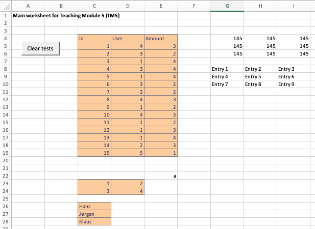
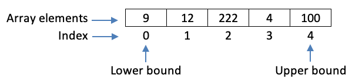
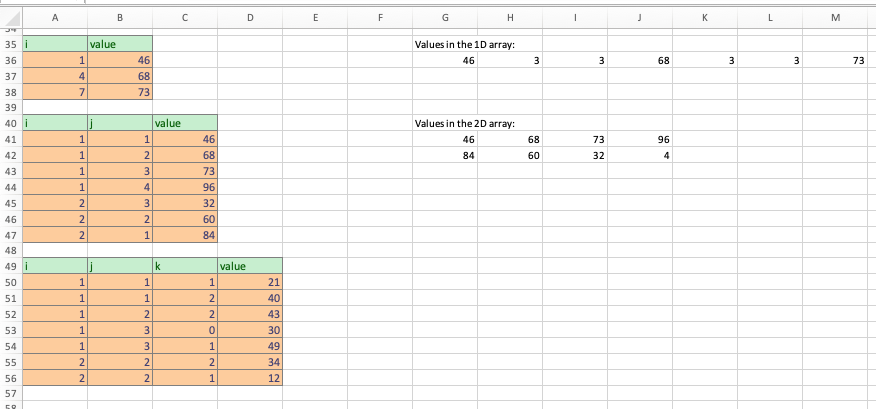

```{r, code = readLines("common.R"), cache = FALSE, include=FALSE}
```

```{r, include=FALSE}
module_number_prefix <- "05"
module_number <- as.numeric(module_number_prefix)
module_name <- "vba-datatypes"
here::i_am(str_c("book/", module_number_prefix, "_", module_name, ".Rmd"))
# module_name_underscore <- str_replace_all(module_name, "-", "_")
sheet_name_prefix <- str_c("TM", module_number)
```


# Advanced data types and usage {#mod-vba-datatypes}

Recall that variables are used to store information that is saved in memory. A variable may store different data types. Until now we have mostly considered basic data types such as an integer, a double or a string. In this module a short introduction to some of the more advanced data types is given such as a group of integers (an array), a range of cells in a worksheet (a range object) or a set of numbers (a collection). 

<!-- You may visualize a variable as a box in memory (see Figure \@ref(fig:vba-memory)). The variable name can be seen as the label on the box. The box can contain for instance a number, a date or a boolean. That is, any data type defined by VBA. All basic data types can be seen in the [VBA documentation](https://docs.microsoft.com/en-us/office/vba/language/reference/user-interface-help/data-type-summary). However, this course will focus on the ones stated above.  -->

#### Learning path diagram {-}

Click/hover the nodes to follow links and see details.

```{r, echo=FALSE, out.width="100%", fig.asp=NA}
g <- create_learning_path(
   url = "https://docs.google.com/spreadsheets/d/1bBe42LHK-bE7CsU9eNBzi_7VNjbmv-Ybr7285pE61jM/edit?usp=sharing", 
   sheet = "vba-datatypes", 
   x_legend = NULL)
render_graph(g, height = 400)
```

If you like a different learning style there is a lot for videos about VBA online such as course [14-Hour VBA Course][vba-yt-course2]. The videos have been pointed out as extra online supplements in the learning path diagram. However, they are not necessary for the course. Since Excel change as new versions arrive and it work on different operating systems, the look in the screenshots and videos might be a bit different from your version. However, you still should be able to understand it. 

## Learning outcomes {#lo-vba-datatypes}

By the end of this module, you are expected to be able to:

* Name different data types and how they effect memory size.
* Declare a variable as a data type.
* Declare and manipulate strings.
* Describe what the object is.
* Declare and set an object.
* Manipulate worksheets (add, delete, clear).
* Understand what a range is and extract info about it such as rows, start row, address, start column etc. 
* Use the current region of a range to get information about the size for data.
* Sort, paste and modify a range.
* Declare and use an array with both fixed and dynamic dimension.
* Sort, read and modify an array.
* Explain why using arrays is often better than ranges.
* Declare and use a collection.
* Explain what a collection of objects are. 
* Use a `For Each` loop to iterate though a collection of objects. 

The learning outcomes relate to the [overall learning goals](#lg-course) number 1, 2, 4, 8 and 9 of the course.

<!-- SOLO increasing: identify · memorise · name · do simple procedure · collect data · -->
<!-- enumerate · describe · interpret · formulate · list · paraphrase · combine · do -->
<!-- algorithms · compare · contrast · explain causes · analyse · relate · derive · -->
<!-- evaluate · apply · argue · theorise · generalise · hypothesise · solve · reflect -->


## Strings {#vba-strings}

Strings contain a group of characters (an empty string is of length zero). Memory requirements vary with the length of the string (10 bytes + length $\cdot$ 2 byte). We use the symbol `&` to concatenate strings (glue strings together):

```
'' Concatenate two strings
Sub TM5_StrConcat()
    Dim strX As String
    Dim strY As String
    Dim strRes As String
    
    strX = "VBA"
    strY = "Strings"
    strRes = strX & " " & strY
    MsgBox (strRes)
    MsgBox (strX & vbCr & strY)   ' use vbCr to insert a new line
End Sub
```

Note you can use constant `vbCr` to add a new line.

There are many [VBA functions that can be used to manipulate strings](https://docs.microsoft.com/en-us/dotnet/visual-basic/language-reference/functions/string-functions). Some examples:

```
'' String functions
Sub TM5_StrFunc()
    Dim str As String
    
    str = "VBA Strings"
    MsgBox ("The length is: " & Len(str))
    MsgBox ("In lowercase: " & LCase(str))
    MsgBox ("Last 7 char: " & Right(str, 7))
    MsgBox ("Replace: " & Replace(str, "Strings", "Rules"))
    MsgBox ("Compare: " & StrComp(str, "VBA Strings"))  ' result is 0 (equal)
    MsgBox ("Compare: " & StrComp(str, "Apple"))        ' result is 1 (str alfabetically after)
    MsgBox ("Compare: " & StrComp(str, "Wait"))         ' result is -1 (str alfabetically before)
    MsgBox ("String is starting at char number: " & InStr(str, "String"))  ' result is 0 if not found
End Sub
```


## Objects {#vba-objects}

VBA have a lot of predefined objects you can use. Think of an object as a datatype that holds a group of variables. Examples of some objects are `Range`, `Worksheet`, and `WorksheetFunction`. Objects are grouped, nested and you refer to an object by specifying the path, e.g.:

```
Workbooks("Jobs.xlsm").Worksheets("Data values").Range("D4").value
```

Here we refer to the value in cell D4 in worksheet *Data values* in the file *Jobs.xlsm*. You may skip parts of the path (VBA then uses the current active one):

```
Workbooks("Jobs.xlsm").Worksheets("Data values").Range("D4").value  ' full specification
Worksheets("Data values").Range("D4").value  ' same result if Excel file "Jobs.xlsm" is active
Range("D4")  ' same result if Excel sheet "Data values" is active and "Jobs.xlsm" file
```

Note `.value` has been dropped in the last line because it is the default, i.e. you do not have to write it explicit. 

Object variables are declared like any other variables:

```
Dim rng As Range
Dim wst As Worksheet
```

Use `Set` to allocate the Object:

```
Set rng = Range("F7")
Set wst = Worksheets("Data values")
```

Now `rng` is a reference to cell F7 and `wst` is a reference to worksheet *Data values*. Think of a reference as a value that identify where in memory the object is. 

<!-- You may declare and set in one go using the `New` keyword: -->

<!-- ``` -->
<!-- Dim col as New Collection  ' col is now an empty collection (0 items) -->
<!-- ``` -->

In the next sections let us have a look at some relevant objects.


## The Worksheet object {#vba-wst}

The `Worksheet` object refer to a worksheet in the Excel file and you can use it to e.g. modify cells:

```
Sub TM5_TestWorksheet()
   ThisWorkbook.Activate  ' activate this workbook
   Worksheets("TM5_Test1").Range("B2") = "Testing Worksheet"  ' write to cell in sheet TM5_Test1
   Sheet_TM5_Test1.Range("B3") = "Use the sheets code name"   ' use the code name (also work if sheet renamed)
   'ThisWorkbook.Worksheets("Test3").Range("B5") = "Test"     ' Error since there is no sheet Test3 in this workbook
   Range("B4") = "Do you know which sheet is active?"         ' Active sheet
   ' Good coding pratice is always to specify the full path (as above) or make the sheet under considration active
   Worksheets("TM5_Test1").Activate  ' Make sheet active so know where is
   Range("B5") = "I know which sheet is active!"
End Sub
```

It is always good practice to make sure that you are working with the correct Excel file. Otherwise you will get errors if another file is active. This can be done using the `ThisWorkbook` object. Similar you either refer to a worksheet directly using its name or its code name. The code name can be set in the Properties window in the VBA editor. An alternative is to activate the worksheet. 

You can use `Worksheet` variables:

```
Sub TM5_TestWorksheetVar()
  Dim wst1 As Worksheet  ' define a variable which hold a reference to a Worksheet object
  Dim wst2 As Worksheet  ' define a variable which hold a reference to a Worksheet object
  Dim rng As Range
  
  Set wst1 = ThisWorkbook.Worksheets("TM5_Test1")  ' set the reference
  Set wst2 = ThisWorkbook.Worksheets("TM5_Test2")  ' set the reference
  wst1.Range("B6") = "Writing using wst1"
  wst2.Range("B2") = "Writing using wst2"
  wst1.Activate   ' just to have a look
End Sub
```

Here by having two worksheet variables we can write directly to cells in different worksheets without activating the worksheet.

You may check if a worksheet exists using:

```
'' Check if a worksheet exists
' @param strName Name of worksheet.
' @return True if exists.
Function WstExists(strName As String) As Boolean
    WstExists = Evaluate("ISREF('" & strName & "'!A1)")
End Function
```

The worksheet object has a lot of *methods/properties* (think of methods as procedures defined inside the object) for instance `wst.Add` and `wst.Delete`. Let us try to define a function that delete a worksheet:

```
'' Delete a worksheet if it exists
' @param strName Name of worksheet.
' @return True if deleted.
' @author Lars Relund <lars@relund.dk>
Function WstDelete(strName As String) As Boolean
    Dim wst As Worksheet
    Dim bln As Boolean
    
    bln = Application.DisplayAlerts
    Application.DisplayAlerts = False   ' no "really want to delete" alert
    If WstExists(strName) Then
        Worksheets(strName).Delete
        WstDelete = True
    Else
        WstDelete = False
    End If
    Application.DisplayAlerts = bln     ' restore value
End Function
```

We first use the function `WstExists` to check if there is a worksheet. If there is, we call the `.delete` method and delete the worksheet. Note since we do not want an alert stating if we really want to delete the worksheet this is disabled using the `Application` object. The function returns true if the worksheet has been deleted.

Let us try to define a function that create a worksheet:

```
'' Create a worksheet
' @param strName Name of worksheet.
' @param blnForce Force deletion of worksheet if exists.
' @return True if created.
Function WstCreate(strName As String, Optional blnForce As Boolean = False) As Boolean
    Dim wst As Worksheet
    
    If blnForce And WstExists(strName) Then Call WstDelete(strName)
    If Not WstExists(strName) Then
        Set wst = Worksheets.Add
        wst.Name = strName
        WstCreate = True
    Else
        WstCreate = False
    End If
End Function
```

We use an optional argument to force deletion of the old worksheet (if a worksheet with the same name). Next, we create the worksheet using the `.Add` method and rename it using the `.Name` method. The function returns true if the worksheet has been created.

Finally, let us create a function that clear a worksheet:

```
'' Clear a worksheet if it exists
' @param strName Name of worksheet.
' @param blnCells Delete cell contents, formats, comments, etc. (default).
' @param blnContents Delete cell contents.
' @param blnFormat Delete cell format.
' @param blnObjects Delete cell buttons and charts.
' @return True if cleared.
Function WstClear(strName As String, _
  Optional blnCells As Boolean = True, _
  Optional blnContents As Boolean = False, _
  Optional blnFormat As Boolean = False, _
  Optional blnObjects As Boolean = False) As Boolean
    Dim wst As Worksheet
    
    On Error Resume Next
    If WstExists(strName) Then
        Set wst = Worksheets(strName)
        If blnCells Then wst.UsedRange.Clear
        If blnContents Then wst.Cells.ClearContents
        If blnFormat Then wst.Cells.ClearFormats
        If blnObjects Then
            wst.ChartObjects.Delete
            wst.Buttons.Delete
        End If
        WstClear = True
    Else
        WstClear = False
    End If
End Function
```

First note that we have a lot of optional arguments depending on what we want to clear. Next the `On Error Resume Next` statement is used to make the program not stop even if an error happens. Finally, depending on the setting of the optional arguments we e.g. clear the format in all cells if `blnFormat` is true.

All the functions above is part of the *[course procedures](#vba-course-procedures)* that you may use 'as is' during the course and at the exam. I will explicitly state if you are not allowed to use them otherwise. All the worksheet procedures start with `Wst` so you easy can find them using auto complete in the VBA editor. All worksheet procedures are stored in the `ModWst` module. You may open the module to have a look at the procedures.

Let us see them in action:

```
'' Test the worksheet functions
Sub TM5_TestWorksheetFunc()
    If WstCreate("Test", blnForce:=True) Then MsgBox ("Created Test")  
    If WstRename("Test", "Test1") Then MsgBox ("Renamed the Test to Test1")  ' only work if no Test1 sheet
    If WstClear("Test8") Then MsgBox ("Cleared Test8") ' no clearing since on sheet with that name
    If WstDelete("Test1") Then MsgBox ("Deleted Test1")
End Sub
```


## The Range object {#wst-rng}

Ranges are objects that refer to parts of a worksheet e.g. a cell, a row, a column, or a rectangular selection of cells. Ranges can be used to read and write to cells

```
Sub TM5_RangeEx1()
   Dim rng As Range
   Dim cell As Range
   Dim i As Integer
   
   Call TM5_ClearTestTM5    ' clear test cells so have empty cells
   ThisWorkbook.Worksheets("TM5").Activate
   ' Modify a range to a fixed value
   Set rng = Range("G4:I6")
   rng = 145   ' cell value in rng
   MsgBox rng.Address   ' range address 
   ' Use for each to scan range (direction left-down)
   Set rng = Range("G8:I10")
   i = 1
   For Each cell In rng
      cell = "Entry " & i
      i = i + 1
   Next
   ' Use Cells to set a range
   Set rng = Range(Cells(23, 3), Cells(25, 6))
   MsgBox rng.Address
End Sub
```

The method `.Address` is used to return the cell address. 

```{r tm5-sheet, echo = FALSE, out.width="700px", fig.cap="TM5 worksheet."} 
 
```

Similar the number of rows can by found using `.rows.Count`:

```
'' Rows in range
' @param rng A range.
Function RngGetRows(rng As Range) As Long
    RngGetRows = rng.rows.Count
End Function
```

We can also find number of columns, address of upper left cell or lower right cell etc. In the [course procedures](#vba-course-procedures) (module *ModRng*) all these have been defined. Let us try to use them:

```
Sub TM5_RangeEx2()
  Dim rng As Range
  
  Set rng = ThisWorkbook.Worksheets("TM5").Range("C4:E19")
  MsgBox ("Number of rows: " & RngGetRows(rng))
  MsgBox ("Number of cols: " & RngGetCols(rng))
  MsgBox ("First column number: " & RngGetFirstCol(rng))
  MsgBox ("First column letter: " & RngGetFirstCol(rng, asLetter:=True))
  MsgBox ("Lower right cell: " & RngGetLowerRight(rng, asString:=True))
  MsgBox ("Upper right cell: " & RngGetUpperRight(rng, asString:=True))
End Sub
```

### Current region of a range

An important method is the current region `.CurrentRegion` which expands the range until all cells surrounding the range is empty. This is very useful if don't know the size for data. Let us make a function that return the current region:

```
'' Return the current region of a range.
' @param rng The range to get the current region from.
Function RngCurRegion(rng As Range) As Range
    Set RngCurRegion = rng.CurrentRegion
End Function
```

Note we have to use the `Set` keyword since the return value is a range (object). We can now test the course procedures starting with prefix `RngGet`:

```
Sub TM5_CurrentRegionEx1()
    Dim rng As Range

    ThisWorkbook.Worksheets("TM5").Activate
    ' Try to guess the output
    Set rng = RngCurRegion(Range("D7"))  ' rng now is the current region
    MsgBox ("Address: " & RngGetAddress(rng))
    MsgBox ("Rows = " & RngGetRows(rng) & " cols = " & RngGetCols(rng))
    MsgBox ("First row number = " & RngGetFirstRow(rng) & ". Last row number = " & RngGetLastRow(rng) & ".")
    MsgBox ("First col number = " & RngGetFirstCol(rng) & ". Last col number = " & RngGetLastCol(rng) & ".")
    MsgBox ("First col letter = " & RngGetFirstCol(rng, True) & ". Last col letter = " & RngGetLastCol(rng, True) & ".")
    ' Try to guess the output
    Set rng = RngCurRegion(Range("C23"))  ' assume we know that data contains cell C23
    MsgBox ("Address: " & RngGetAddress(rng))
End Sub
```

The same result can be obtained using the course procedures starting with `RngGetCurRegion`:

```
Sub TM5_CurrentRegionEx2()
    Dim rng As Range

    ThisWorkbook.Worksheets("TM5").Activate
    ' Try to guess the output
    Set rng = Range("D7")  ' assume we know that data contains cell D7
    MsgBox ("Address: " & RngGetCurRegionAddress(rng))
    MsgBox ("Rows = " & RngGetCurRegionRows(rng) & " cols = " & RngGetCurRegionCols(rng))
    MsgBox ("First row number = " & RngGetCurRegionFirstRow(rng) & ". Last row number = " & RngGetCurRegionLastRow(rng) & ".")
    MsgBox ("First col number = " & RngGetCurRegionFirstCol(rng) & ". Last col number = " & RngGetCurRegionLastCol(rng) & ".")
    MsgBox ("First col letter = " & RngGetCurRegionFirstCol(rng, True) & ". Last col letter = " & RngGetCurRegionLastCol(rng, True) & ".")
    
    Set rng = Range("C23")  ' assume we know that data contains cell C23
    MsgBox ("Address: " & RngGetCurRegionAddress(rng))
End Sub
```

Note the difference in how `rng` is defined.

### Input and output

You can read/write and copy/paste values to a range using the course procedures:

```
Sub TM5_RangeEx3()
    Dim rng As Range
    Dim rngNew As Range
    
    Set rng = RngCurRegion(Range("D7"))         ' get current region
    MsgBox ("Copy to H14 (upper left corner).")
    Set rngNew = RngPaste(rng, Range("H14"))    ' rngNew is now the new range
    MsgBox ("Make yellow.")
    Call RngFormat(rngNew, "yellow")
    MsgBox ("Remove format.")
    Call RngClear(rngNew, blnCells:=False, blnFormat:=True)
    MsgBox ("Clear range.")
    Call RngClear(rngNew)
End Sub
```

Here `RngPaste` is used to copy a range and paste it to another range. Note you may use `RngFormat` to format cells of a range.

Moreover, you can read/write values from/to a csv file. A [comma-separated values (csv) file](https://en.wikipedia.org/wiki/Comma-separated_values) is a delimited text file that uses a delimiter to separate values. Each line of the file is a data record. Each record consists of one or more fields, separated by the delimiter. The file format is not fully standardized, i.e. the delimiter may be a semicolon, a colon or another delimiter. Moreover, a field may be surrounded with quotation marks. Let us have a look at a csv file `data1.csv` with a header using a semicolon as delimiter:

```
Year;Brand;Model
1997;Ford;E350
2000;Mercury;Cougar
```

and the csv file `data2.csv` without a header using a semicolon as delimiter:

```
55,18,34,1,81,26,90,11,46,32,93
49,95,73,82,53,40,99,10,52,38,92
59,90,97,100,59,73,88,33,78,61,24
96,84,32,36,94,82,49,94,48,49,1
59,21,24,57,3,78,54,79,57,42,8
```

Let us try to read the two files:

```
Sub TM5_RngFromCSVEx()
    Dim rng As Range
    
    ThisWorkbook.Worksheets("TM5").Activate
    Call TM5_ClearTestTM5    ' clear test cells so have empty cells
    '' Read data1.csv file (NOTE you must know the separator in the csv file beforehand!)
    Range("G3") = "Content of data1.csv:"
    Set rng = RngFromCSV("data1.csv", Range("G4"), ";") ' paste file in range with upper left cell G4
    MsgBox (RngGetAddress(rng))
    '' Read data2.csv file (NOTE you must know the separator in the csv file beforehand!)
    Range("G8") = "Content of data2.csv:"
    Set rng = RngFromCSV("data2.csv", Range("G9"), ",") ' paste file in range with upper left cell G9
    MsgBox (RngGetAddress(rng))
End Sub
```

Here we use the course procedure `RngFromCSV` to read the file and specify the upper left corner cell of where to paste. Note the function returns the pasted range.  

You can write the content of a range to a csv file using:

```
Sub TM5_RngToCSVEx()
    Dim rng As Range
    
    ThisWorkbook.Worksheets("TM5").Activate
    Call TM5_ClearTestTM5    ' clear test cells so have empty cells
    '' Write to csv file
    Set rng = Range("C4:E19")
    Call RngToCSV("test.csv", rng, ";")     ' semicolon (;) separated file
    '' Read test.csv file to check
    Range("G3") = "Content of test.csv:"
    Set rng = RngFromCSV("test.csv", Range("G4"), ";")
End Sub
```

Here we use the course procedure `RngToCSV` to write the range to the file. Note you can specify different delimiters (here we use a semicolon).


### Sorting a range

Ranges can be sorted using the [`.Sort`](https://docs.microsoft.com/en-us/office/vba/api/excel.range.sort) method:

```
Sub TM5_SortRangeEx()
    Dim rng As Range
    Dim rngCur As Range
    
    ThisWorkbook.Worksheets("TM5").Activate
    Call TM5_ClearTestTM5    ' clear test cells so have empty cells
    Set rng = RngCurRegion(Range("C4"))
   
    '' Sort based on second column ascending
    Set rngCur = RngPaste(rng, Range("G4"), withFormat:=True)  ' make a copy to work with
    Call rngCur.Sort(Key1:=rngCur.Columns(2), Header:=xlYes)
    rngCur(1).Offset(-1, 0) = "Sort 2. column"  ' offset first cell in range by -1 row and 0 col

    '' Sort based on second column and afterwards 3. column (descending)
    Set rngCur = RngPaste(rng, Range("K4"), True)
    Call rngCur.Sort(Key1:=rngCur.Columns(2), Header:=xlYes, Key2:=rngCur.Columns(3), Order2:=xlDescending)
    rngCur(1).Offset(-1, 0) = "Sort 2. and next 3. column"
End Sub
```

We use the `Key` arguments to identify which columns we want to sort and the `Header` argument to identify if the first row in the range is a header. Finally the ordering is given using the `Order` argument (either xlAscending (default) or xlDescending).


## Arrays {#vba-ary}

Arrays are used to store groups of variables of a specific datatype: 

```
'' Define an array (run using the debugger - step into)
' How to check the content of an array?
' Use the Locals window together with debug mode or a message box
Sub TM5_ArrayEx1()
   Dim intAry(4) As Integer      ' define array with index 0-4
   Dim strAry(3 To 5) As String  ' define array with index 3-5
   Dim i As Integer
   
   ' Set values
   intAry(0) = 9
   intAry(1) = 12
   intAry(2) = 222
   intAry(3) = 4
   intAry(4) = 100
   ' Information about the array
   MsgBox ("Lowest index: " & LBound(intAry))
   MsgBox ("Largest index: " & UBound(intAry))
   MsgBox ("Number of elements: " & UBound(intAry) - LBound(intAry) + 1)
   MsgBox ("Array as a string: " & AryToStr(intAry))
   ' Read and assign values
    For i = 3 To 5
        strAry(i) = ThisWorkbook.Worksheets("TM5").Cells(23 + i, 3)
    Next
    MsgBox ("Array values: " & AryToStr(strAry))
End Sub
```

Array `intAry` contain 5 elements which can be accessed using index 0, 1, 2, ..., 4. In memory this is done by allocating memory for 5 integers (see Figure \@ref(fig:vba-ary)) with index 0-4. The lower and upper index bounds can be found using `LBound` and `UBound` and we can use the course procedure `AryToStr` to print it. 

```{r vba-ary, echo = FALSE, out.width="60%", fig.cap="An array in memory."} 
 
```

Note the default start index is 0. If you want another start index you can use e.g. `Dim strAry(3 To 5) As String` which use indices 3-5 ($3 = 5-3+1$ elements). Moreover, if you want to start with index 1 as default then add `Option Base 1` to the top of your module.

Arrays require 20 bytes of memory plus 4 bytes for each array dimension plus the number of bytes occupied by the data itself. A Variant containing an array requires 12 bytes more than the array alone.


### Multi-dimensional arrays

```{r vba-ary-3d, echo = FALSE, out.width="100%", fig.cap="Arrays with different dimensions."} 
knitr::include_graphics("./img/3d-array.png") 
```

An array can have different dimensions (see Figure \@ref(fig:vba-ary-3d)) e.g. and array with three dimensions is declared using: 

```
Dim intOrderSize(52, 100, 50) As Integer  
```

where indices may be (week, customer, product) number. Let us assume that index start from 1 then we have an array with $52 \cdot 100 \cdot 50$ elements which can be accessed using e.g.

```
MsgBox(intOrderSize(2, 10, 20))  ' order size week 2, customer 10, product 20 
```

Let us consider an example:

```
Sub TM5_MultiDimArrayEx()
    Dim intA(20, 10) As Integer
    Dim i As Integer, j As Integer
    
    ThisWorkbook.Worksheets("TM5").Activate
    Call TM5_ClearTestTM5    ' clear test cells so have empty cells
    ' Assign some values
    For i = LBound(intA, 1) To UBound(intA, 1)
        For j = LBound(intA, 2) To UBound(intA, 2)
            intA(i, j) = WorksheetFunction.RandBetween(1, 1000)
        Next
    Next
    ' print results from G4
    For i = LBound(intA, 1) To UBound(intA, 1)
        For j = LBound(intA, 2) To UBound(intA, 2)
            Cells(i + 4, j + 7) = intA(i, j)
        Next
    Next
    ' Call AryPaste(intA, Range("G4")) ' same result
End Sub
```

We first assign random values to `intA` in the first loop. Note we use `LBound` and `UBound` to find the range of the indices (the second argument is the dimension we consider). Next, the results are printed to the sheet with upper left equal to G4. Here you may also have used the course procedure `AryPaste` instead.


### Dynamic arrays

Often we do not know the size of the array we need when we start the program. For this we use dynamic arrays:

```
Sub TM5_DynArrayEx()
    Dim ary() As String   ' dynamic array, note use empty ()
    Dim i As Integer
    
    ThisWorkbook.Worksheets("TM5_Test3").Activate
    ReDim ary(2 To 5)  ' create entries a(2) to a(5)
    For i = 2 To 5
        ary(i) = Cells(i + 1, 1)   ' read from Array sheet
    Next
    MsgBox ("Values are: " & AryToStr(ary))
    MsgBox ("The lowest and higest index are " & LBound(ary) & " and " & UBound(ary))
    
    ReDim ary(3 To 5)  ' reallocate array, all values are set to default (empty string)
    MsgBox ("Values are: " & AryToStr(ary))
    For i = 3 To 5
        ary(i) = Cells(i + 1, 1)
    Next
    MsgBox ("Values are: " & AryToStr(ary))
    MsgBox ("The lowest and higest index are " & LBound(ary) & " and " & UBound(ary))
End Sub
```

First, the dynamic array is declared using empty parenthesis `Dim ary() As String`. Next the `ReDim` keyword is used to set the dimension.


### Input and output 

A set of [course procedures](#vba-course-procedures) (module *ModAry*)  have been defined to read/set the values in an array and output the values of an array:

```
Sub TM5_IOAryEx()
    Dim ary() As Integer
    Dim strAry() As String
    
    ThisWorkbook.Worksheets("TM5").Activate
    Call TM5_ClearTestTM5
    '' Set to value single value
    ReDim ary(2)
    Call AryToVal(ary, 5)
    Range("G4") = "A fixed value:"
    Call AryPaste(ary, Range("G5")) ' the upper left cell is G5
    '' Paste vertical
    Range("K4") = "Paste vertical:"
    Call AryPaste(ary, Range("K5"), False)
    '' Set to sequence
    Call AryToSeq(ary, 1, 6)
    Range("G10") = "A sequence:"
    Call AryPaste(ary, Range("G11"))
    '' Read strings from a range
    Call AryRead(strAry, Range("C31:D33"))  ' read a 2D array
    Range("G31") = "Names in the " & AryDim(strAry) & "D array:"
    Call AryPaste(strAry, Range("G32"))
End Sub
```

You set all entries in the array to a single value using `AryToVal` and a sequence using `AryToSeq`. Moreover, use `AryRead` to read the values of a range into an array. Finally, `AryPaste` can be used to paste values of an array to a sheet. You just have to specify the upper left cell where you want to paste.

Procedure `AryRead` can both read values into 1D and 2D arrays:

```
Sub TM5_AryReadEx()
    Dim ary() As Integer

    ThisWorkbook.Worksheets("TM5").Activate
    Call TM5_ClearTestTM5
    '' Read values from a range with only 1 column
    Call AryRead(ary, Range("C5:C9"))
    Range("G4") = AryDim(ary) & "D array:"
    Call AryPaste(ary, Range("G5"), False)
    '' Read values from a range with only 1 row
    Call AryRead(ary, Range("C5:E5"))
    Range("I4") = AryDim(ary) & "D array:"
    Call AryPaste(ary, Range("I5"))
    '' Read values from a range with only 1 column/row but use 2D array
    Call AryRead(ary, Range("C11:C14"), blnReduceDim:=False)
    Range("G10") = AryDim(ary) & "D array:"
    Call AryPaste(ary, Range("G11"), False)
    '' Use other start and end index
    Call AryRead(ary, Range("C17:E19"), intStartIdx1:=2, intStartIdx2:=5)
    Range("G16") = AryDim(ary) & "D array with start index " & LBound(ary, 1) & " and " & LBound(ary, 2) & ":"
    Call AryPaste(ary, Range("G17"))
End Sub
```

First, note that if the optional argument `blnReduceDim` is not set to false the array automatically becomes a 1D array if a range with one row or column is read. Next, you can use another start index of the array (default is 1) by specifying the optional arguments `intStartIdx1` and `intStartIdx2`.

Procedure `AryRead` fails if we want to set values for arrays with more than 2 dimensions. For this the `AryReadLong` can be used which can read arrays until five dimensions:    

```
Sub TM5_AryReadLongEx()
    Dim ary() As Integer
    
    ThisWorkbook.Worksheets("TM5").Activate
    Call TM5_ClearTestTM5
    '' Read 1D array
    Call AryReadLong(ary, Range("A36:B38"), 3)   ' default value = 3
    Range("G35") = "Values in the " & AryDim(ary) & "D array:"
    Call AryPaste(ary, Range("G36"))
    '' Read 2D array
    Call AryReadLong(ary, Range("A41:C47"), 4)   ' default value = 4
    Range("G40") = "Values in the " & AryDim(ary) & "D array:"
    Call AryPaste(ary, Range("G41"))
    '' Read 3D array (cannot be pasted to the sheet, have a look at it using the debugger)
    Call AryReadLong(ary, Range("A50:D56"), 5)   ' default value = 5
End Sub
```

Procedure `AryReadLong` assumes that you specify the values in long format, i.e. there is index values in all columns except the last which contains the values (see Figure \@ref(fig:tm5-arylong)). For instance, if we consider row 54, then the specification says that `ary(1,3,1) = 49`. Note we do not have to specify all combination of indices, e.g. in the specification A41:C47 the index (2,4) is missing and set to the default value 4. It is assumed that indices start from the lowest to highest index in each dimension.

```{r tm5-arylong, echo = FALSE, out.width="800px", fig.cap="Reading values to an array using a long format (TM5 worksheet)."} 
 
```

You can also read a csv file into an array. Let us have a look at a csv file `data2.csv` using a semicolon as delimiter:

```
55,18,34,1,81,26,90,11,46,32,93
49,95,73,82,53,40,99,10,52,38,92
59,90,97,100,59,73,88,33,78,61,24
96,84,32,36,94,82,49,94,48,49,1
59,21,24,57,3,78,54,79,57,42,8
```

You can read the values into an array using `AryFromCSV`:

```
Sub TM5_AryReadCSVEx()
    Dim rng As Range
    Dim ary() As Integer
    
    ThisWorkbook.Worksheets("TM5").Activate
    Call TM5_ClearTestTM5
    '' Read csv file (NOTE you must know the separator in the csv file beforehand!)
    Range("G3") = "Array values:"
    Call AryFromCSV(ary, "data2.csv", ",")   ' know that it contains integers (otherwise use variant)
    Call AryPaste(ary, Range("G4"))
End Sub
```

### Sorting arrays

Arrays can be sorted using `AryQuickSort`:

```
Sub TM5_ArySortEx()
    Dim ary() As Integer
    
    ThisWorkbook.Worksheets("TM5").Activate
    Call TM5_ClearTestTM5
    
    '' Read from a range and sort
    Call AryRead(ary, Range("C5:E19"))
    Call AryQuickSort(ary, 2)
    Range("G3") = "Sort w.r.t. 2. column:"
    Call RngPaste(Range("C4:E4"), Range("G4"))  ' copy header
    Call AryPaste(ary, Range("G5"))
End Sub
```

Here we sort based on the 2. column in the array.


### Use arrays instead of ranges

Since a range represent a block of cells in a sheet, one may think of a range a some kind of 1D or 2D array. Hence one may use a range directly to read/write values instead of an array (we did that in Section \@ref(vba-test-persons)). However, often arrays are better to use than ranges:

   * You can set indices as you like so they give a meaning to you, e.g. `intOrderSize(2, 10, 20)` denote the order size of product 20, in week 2 for customer 10.
   * Arrays are much faster to update that ranges. It is much faster to  update the values many times in an array compared to a range.
   * You worksheet and ranges may be seen as a place where you keep your data. Hence, when you run an algorithm, you first read the data into some arrays. Next, do some calculations (update the arrays) and finally output the result to a worksheet again. 

Consider for example the distance matrix calculations in Section \@ref(vba-ex-dist-mat). Here it would be faster to store the distance matrix in a 2D array:

```
Sub TM5_MakeDistArray()
    Dim n As Integer
    Dim aryDist() As Double
    Dim i As Integer
    Dim j As Integer
    
    ThisWorkbook.Worksheets("TM3_DistanceMatrix").Activate
    n = Range("E1")
    ReDim aryDist(1 To n, 1 To n)
    For i = 1 To n
        For j = i + 1 To n
           aryDist(i, j) = TM3_Distance(Cells(i + 1, 2), Cells(i + 1, 3), Cells(j + 1, 2), Cells(j + 1, 3))
           aryDist(j, i) = aryDist(i, j)  ' set symetric value
        Next
    Next
End Sub
```

Afterwards `aryDist` can be used during in an algorithm. 


## Collections {#vba-coll}

Collections are a way of storing a group of items together (think of it as a set). Collections and arrays are both used to group variables. They both store a set of items e.g. a list of student marks or country names. If we compare collections against arrays:

- Collections are similar to arrays but better to use when the number of items is not fixed. With an array you normally set the size once. On the contrary you often add or remove items from a collection.
- Collections are better when adding and removing items.
- An item in a collection are read-only whereas an entry in an array are read/write.
- Collection can be accessed using a key or an index (starting from 1).
- Items of a collection do not have to share the same data type.

Collections are a part of the predefined objects in VBA and hence a collection have to be defined in a special way. Let us consider an example:

```
Sub TM5_CollEx()
    Dim col As New Collection   ' declare and create
    Dim e As Variant
    
    ThisWorkbook.Worksheets("TM5").Activate
    Call TM5_ClearTestTM5
    '' Add items
    Call col.Add("Apple")
    Call col.Add("Pear")
    Call col.Add(123)
    Cells(4, 7) = "The collection now contains " & col.Count & " items: " & Coll2Str(col)
    '' Use For Each to scan elements
    For Each e In col
      MsgBox (e)
    Next e
    '' Access values in the collection using index
    Cells(5, 7) = "The 1. item is: " & col(1)
    Cells(6, 7) = "The 3. item is: " & col(3)
    ' Remove items
    Call col.Remove(2)
    Cells(7, 7) = "The collection now contains " & col.Count & " items: " & Coll2Str(col)
    '' Note index of items has now changed (the 3. item has become the 2. item)
    Cells(8, 7) = "The 1. item is: " & col(1)
    Cells(9, 7) = "The 2. item is: " & col(2)
    '' Clear collection
    Set col = Nothing
    Cells(10, 7) = "The collection now contains " & col.Count & " items."
End Sub
```

First we declare and create a collection:
```
Dim col As New Collection
```
The collection (or set) is now defined with zero items. You can add items using
```
Call col.Add("Apple")
Call col.Add("Pear")
Call col.Add(123)
```
Let us create a function that prints the items of a collection as string:
```
Function Coll2Str(col As Collection, Optional strSep As String = ", ") As String
    Dim e As Variant
    Dim str As String
    
    For Each e In col
        str = str & e & strSep
    Next e
    Coll2Str = Left(str, Len(str) - Len(strSep))
End Function
```
Then the output of 
```
"The collection now contains " & col.Count & " items: " & Coll2Str(col)
```
becomes
```
The collection now contains 3 items: Apple, Pear, 123
```
You can access values in the collection using index:
```
"The 1. item is: " & col(1)
"The 3. item is: " & col(3)
```
```
The 1. item is: Apple
The 3. item is: 123
```
Items are removed using:
```
Call col.Remove (2)
"The collection now contains " & col.Count & " items: " & Coll2Str(col)
```

```
The collection now contains 2 items: Apple, 123
```

Note index of items has now changed (the 3. item has become the 2. item):
```
"The 1. item is: " & col(1)
"The 2. item is: " & col(2)
```

```
The 1. item is: Apple
The 2. item is: 123
```

You clear a collection using:
```
Set col = Nothing
"The collection now contains " & col.Count & " items."
```

```
The collection now contains 0 items.
```

An item in a collection can be given a key (think af a key as a name tag given to each item):

```
Sub TM5_CollKeyEx()
    Dim col As New Collection   ' declare and create
    Dim k As Variant
    
    ThisWorkbook.Worksheets("TM5").Activate
    '' Add using keys
    Call col.Add("Hans Jørgensen", "ID123")   ' value, key
    Call col.Add("Jens Hansen", "ID234")
    Call col.Add("Lone Nielsen", "ID456")
    ' col.Add "Sine Mikkelsen", "ID456" ' gives an error since already used the key
    Cells(12, 7) = "The collection now contains " & col.Count & " items: " & Coll2Str(col)
    '' Access values using keys
    Cells(13, 7) = "The item with key ID123 is: " & col("ID123")
    ' Remove items using keys
    col.Remove "ID123"
    Cells(14, 7) = "The collection now contains " & col.Count & " items: " & Coll2Str(col)
End Sub
```

Here we add items using a key:

```
Call col.Add("Hans Jørgensen", "ID123")   ' value, key
Call col.Add("Jens Hansen", "ID234")
Call col.Add("Lone Nielsen", "ID456")
"The collection now contains " & col.Count & " items: " & Coll2Str(col)
```

```
The collection now contains 3 items: Hans Jørgensen, Jens Hansen, Lone Nielsen
```
You can now access the item using the key:
```
"The item with key ID123 is: " & col("ID123")
```

```
The item with key ID123 is: Hans Jørgensen
```
Similar you can remove an item using a key:
```
Call col.Remove("ID123")
"The collection now contains " & col.Count & " items: " & Coll2Str(col)
```

```
The collection now contains 2 items: Jens Hansen, Lone Nielsen
```

It is recommended to use keys since using keys has three advantages:

- If the order changes your code will still access the correct item
- You can directly access the item without reading through the entire collection
- It can make you code more readable

For more information about collections you may have a look at this [webpage](http://excelmacromastery.com/excel-vba-collections/).


## Example - Job sequencing {#vba-ex-job-seq}

Consider $i = 1,...,n$ jobs that has to be done on a machine and let $c_{ij}$ denote the setup cost of switching from job $i$ to job $j$. Moreover, let $c_{0i}$ denote the setup cost of setting up job $i$ when the machine is idle (index 0). Let $s = (0, s_1, \ldots, s_n)$ denote the sequence of jobs and $C$ the total setup costs, e.g. if $s = (0,1,3,2,6,5,4)$, then $C = c_{01} + c_{13} + c_{32} + c_{26} + c_{65} + c_{54}$. Different algorithms for finding a good strategy minimizing the total setup costs exists. A greedy algorithm is:

<div class="box">
**Step 0**: Select the first job as one with minimal idle setup cost.

**Step 1**: Given current job $i$ select the unscheduled with minimal setup cost. 

**Step 2**: If no unscheduled jobs then stop and output the found job sequence else go to Step 1.
</div>

Often a better algorithm is:

<div class="box">
**Step 0**: For each column $j$ find $\bar{c}_j = min(c_{0j},\ldots,c_{j-1,j},c_{j+1,j},\ldots,c_{nj})$ and define relative setup costs $\hat{c}_{ij} = c_{ij}-\bar{c}_{j}$ (the cost is subtracted the minimum value in that column).

**Step 1**: Call the greedy algorithm using costs $\hat{c}_{ij}$.
</div>

Examples on how data could look like can be seen in worksheet *TM5_JobSeq* that contains the setup costs (Figure \@ref(fig:tm5-job-seq)). Columns M-T contain three datasets for which we want to calculate a job sequence.

```{r tm5-job-seq, echo = FALSE, out.width="100%", fig.cap="Worksheet *TM5_JobSeq*."} 
knitr::include_graphics("./img/tm5-job-seq.png") 
```

Let us try to implement the greedy algorithm which takes the cost array `costs` as arguments and output the job sequence and cost:

```
'' Job sequeceing using a cost array
'
' @param costs An array with setup costs
' @param strSeq The job sequence found (returned ByRef).
' @param dblCosts The total setup costs (returned ByRef).
Sub TM5_GreedyAlg(costs() As Double, strSeq As String, dblCosts As Double)
    Dim intJobs As Integer          ' number of jobs
    Dim used() As Integer           ' an entry equals 1 if already scheduled
    Dim intCurJob As Integer        ' current job
    Dim intNextJob As Integer       ' best candidate for next job (= intM if not found yet)
    Dim dblNextCost As Double       ' setup cost current to next job
    Dim c As Integer                ' iterators
    Dim intM As Integer             ' big number

    '' Allocate arrays
    intJobs = UBound(costs, 1)
    ReDim used(1 To intJobs)    ' set size
    Call AryToVal(used, 0)      ' set to 0
    
    '' Run greedy
    strSeq = "0"  ' start idle
    intM = 1000   ' a number bigger than largest cost
    intCurJob = 0  ' start idle
    dblCosts = 0
    Do While True ' find next job given current
        intNextJob = intM
        dblNextCost = intM
        For c = 1 To intJobs ' scan row in array to find next unused job with minimal cost
            If used(c) <> 1 And costs(intCurJob, c) < dblNextCost Then
                intNextJob = c
                dblNextCost = costs(intCurJob, c)
            End If
        Next
        If intNextJob = intM Then Exit Do  ' no new job found (all jobs used)
        dblCosts = dblCosts + dblNextCost
        used(intNextJob) = 1
        intCurJob = intNextJob
        strSeq = strSeq & ", " & intNextJob
    Loop
End Sub
```

First observe that the procedure have three arguments `costs`, `strSeq` and `dblCosts`. The array `costs` contain the setup costs and is an input argument to the algorithm. The last two arguments are output arguments. Since arguments are passed by reference by default (no new memory is allocated), we modify them with the solution. Next, to run the algorithm we need to keep track of which jobs have been used. We use the array `used` for this and set it to 0 (not used) and 1 (used). Finally, the `Do While` loop is used to scan a row in the cost array. We want to find the minimum cost and hence use a big number as starting value, then scan all unused jobs and choose the one with minimum cost. If no new job is found we finish; otherwise we update `strSeq` and `dblCosts`.

Note that the procedure do not have any interaction with a worksheet. It simply takes an array as input argument and store the result in two output arguments. That is, the procedure is independent of where the data is from (could e.g. be an csv file instead of a worksheet).

Let us try to link the greedy algorithm to the data in workheet *TM5_JobSeq*. Columns M-T contain three datasets for which we want to calculate a job sequence. First, let us make a procedure that copies a dataset to A4 (upper left cell):

```
Sub TM5_CopyData()
   Dim str As String
   
   ThisWorkbook.Worksheets("TM5_JobSeq").Activate   ' so use the correct sheet
   str = InputBox("Specify cell in data (e.g. N7)") ' get a cell value
   Call TM5_CleanJobSeq                             ' delete previous data
   Call RngPaste(RngCurRegion(Range(str)), Range("A4"), withFormat:=True) ' paste the current region
End Sub
```

Note we use the current region of the cell value to retrieve the dataset. We can now run the greedy algorithm using the data starting in A4:

```
Sub TM5_RunGreedy()
    Dim costs() As Double  ' setup costs
    Dim strSeq As String   ' job seq
    Dim dblCosts As Double ' total setup costs
    Dim rng As Range

    ThisWorkbook.Worksheets("TM5_JobSeq").Activate
    ' Allocate costs to array
    Set rng = RngCurRegion(Range("A4")) ' rng now is the whole dataset with headers
    Set rng = Range("B5:" & RngGetLastCol(rng, asLetter:=True) & RngGetLastRow(rng)) ' rng now is the costs
    Call AryRead(costs, rng, 0, 1) ' start index from 0 (first dim) and 1 (second dim)
    ' Run algorithm
    Call TM5_GreedyAlg(costs, strSeq, dblCosts)
    ' Write results to sheet
    Range("C1") = UBound(costs, 1)
    Range("C2") = strSeq
    Range("F1") = dblCosts
End Sub
```

First, observe how we allocate values to the 'costs' array. We use the course procedure `AryRead` and hence first have to find the range containing the setup costs. This can be done may ways, but we know that the upper left cell is B5 and the lower right is found using the `RngGet` functions. Next, we call `AryRead` and set the index to start from 0 (first dimension) and 1 (second dimension). Given setup costs, we call the greedy algorithm which returns updated `strSeq` and `dblCosts`. Finally, we output the results to the worksheet. 

To implement the 'better' algorithm we need to modify the `costs` array and subtract the minimum column value:

```
Sub TM5_RunBetter()
    Dim minCol() As Double ' min value in col c
    Dim intJobs As Integer ' number of jobs
    Dim costs() As Double  ' setup costs
    Dim strSeq As String   ' job seq
    Dim dblCosts As Double ' total setup costs
    Dim rng As Range
    Dim dbl As Double
    Dim r As Integer, c As Integer
    
    ThisWorkbook.Worksheets("TM5_JobSeq").Activate
    ' Allocate costs to array
    Set rng = RngCurRegion(Range("A4")) ' rng now is the whole dataset with headers
    Set rng = Range("B5:" & RngGetLastCol(rng, asLetter:=True) & RngGetLastRow(rng)) ' rng now is the costs
    Call AryRead(costs, rng, 0, 1) ' start index from 0 (first dim) and 1 (second dim)
    ' Calc min value in each col
    intJobs = UBound(costs, 1)
    ReDim minCol(1 To intJobs)
    For c = 1 To intJobs
        dbl = 10000000   ' a big number
        For r = 0 To intJobs
            If costs(r, c) < dbl And r <> c Then dbl = costs(r, c)
        Next
        minCol(c) = dbl
    Next
    ' Calc relative
    For c = 1 To intJobs
        For r = 0 To intJobs
            costs(r, c) = costs(r, c) - minCol(c)
        Next
    Next
    ' Run algorithm
    Call TM5_GreedyAlg(costs, strSeq, dblCosts)
    ' Write results to sheet
    Range("C1") = intJobs
    Range("C2") = strSeq
    Range("F1") = dblCosts + WorksheetFunction.Sum(minCol)
End Sub
```

First, an array `minCol` is used to store the minimum values for each column. Next, we update the `costs` array with the relative values and the greedy algorithm is run with the relative setup cost values. Finally, we output the results. Note we have to add the minimum costs back to `dblCosts` (the sum of the `minCol` values). 


## Recap

- Variables are used to store information that is saved in memory. A variable may store different data types such an integer, a double, a group of doubles (an array), a range of cells in a worksheet (a range object) or a set of numbers (a collection). 

- Strings are special variables with varying length.

- Use the `&` to concatenate strings (glue strings together).

- An empty string is of length zero.

- VBA have a lot of predefined objects you can use. Think of an object as a datatype that holds a group of variables. Examples of some objects are `Range`, `Worksheet`, and `WorksheetFunction`. 

- Refer to an object by specifying the path in the hierarchy e.g. 
  ```
  Workbooks("Jobs.xlsm").Worksheets("Data values").Range("D4").value
  ```
  You may skip parts of the path (VBA then uses the current active one).
- Warning, you must know which sheet is active. Always specify what you want to be active	
  ```
  ThisWorkbook.Worksheets("Data values").Activate  ' activate the sheet
  dbl = Range("D4")
  ```
- Declare object variables using:
  ```
  Dim rng As Range
  Dim wst As Worksheet
  ```
- Set a reference to object variables using the keyword `Set`:
  ```
  Set rng = Range("F7")
  Set wst = Worksheets("Data values")
  ```
- A `Worksheet` object refer to a worksheet and you can use it to e.g. modify cells:
  ```
  Worksheets("TM5_Test1").Range("B2") = "Testing Worksheet"  ' write to cell in sheet TM5_Test1
  Set wst1 = ThisWorkbook.Worksheets("TM5_Test1")  ' set a reference to a worksheet
  wst1.Range("B6") = "Writing using wst1"
  ```
- Different functions for worksheets is part of the *[course procedures](#vba-course-procedures)*. All the worksheet procedures start with `Wst` so you easy can find them using auto complete in the VBA editor. All worksheet procedures are stored in the `ModWst` module. You may open the module to have a look at the procedures. Examples:
  ```
  If WstCreate("Test", blnForce:=True) Then MsgBox ("Created Test")  
  If WstRename("Test", "Test1") Then MsgBox ("Renamed the Test to Test1")  ' only work if no Test1 sheet
  If WstClear("Test8") Then MsgBox ("Cleared Test8") ' clear sheet Test8 if exists
  If WstDelete("Test1") Then MsgBox ("Deleted Test1")
  ```

- Ranges are objects that refer to parts of a worksheet e.g. a cell, a row, a column, or a rectangular selection of cells. 

- Ranges can be used to read and write to cells
  ```
  Dim rng As Range
  Set rng = Range("A1:D5")
  rng = 145   ' cell value
  MsgBox rng.Address   ' range address ($A$1:$D$5)
  ```

- You can use the [course procedures](#vba-course-procedures) (module *ModRng*) with prefix `RngGet` to retrieve info about the range: 
  ```
  Set rng = ThisWorkbook.Worksheets("TM5").Range("C4:E19")
  MsgBox ("Number of rows: " & RngGetRows(rng))
  MsgBox ("Number of cols: " & RngGetCols(rng))
  MsgBox ("First column number: " & RngGetFirstCol(rng))
  MsgBox ("First column letter: " & RngGetFirstCol(rng, asLetter:=True))
  MsgBox ("Lower right cell: " & RngGetLowerRight(rng, asString:=True))
  MsgBox ("Upper right cell: " & RngGetUpperRight(rng, asString:=True))
  ```
  
- The current region of a range is found by expanding the range until all cells surrounding the range is empty
  ```
  rng = Range("D23").CurrentRegion
  ```
  This is useful if don't know the size for data.

- You can use the [course procedures](#vba-course-procedures) (module *ModRng*) with prefix `RngGetCurRegion` to retrieve info about the current region of a range: 
  ```
  Set rng = Range("D7")  ' assume we know that data contains cell D7
  MsgBox ("Address: " & RngGetCurRegionAddress(rng))
  MsgBox ("Rows = " & RngGetCurRegionRows(rng) & " cols = " & RngGetCurRegionCols(rng))
  MsgBox ("First row number = " & RngGetCurRegionFirstRow(rng) & ". Last row number = " & RngGetCurRegionLastRow(rng) & ".")
  MsgBox ("First col number = " & RngGetCurRegionFirstCol(rng) & ". Last col number = " & RngGetCurRegionLastCol(rng) & ".")
  MsgBox ("First col letter = " & RngGetCurRegionFirstCol(rng, True) & ". Last col letter = " & RngGetCurRegionLastCol(rng, True) & ".")
  ```
  
- You copy/paste a range using:
  ```
  Set rng = Range("D7:E10")      
  Set rngNew = RngPaste(rng, Range("H14"))    ' paste with upper left = H14, rngNew is now the new range
  ```
- You can read values from a csv file using:
  ```
  Set rng = RngFromCSV("data1.csv", Range("G4"), ";") ' paste file in range with upper left cell G4
  ```
- You can write values from a range to a csv file using:
  ```
  Call RngToCSV("test.csv", rng, ";")     ' semicolon (;) separated file
  ```
  
- The columns in a range can be [sorted](https://docs.microsoft.com/en-us/office/vba/api/excel.range.sort). For instance sort a range ascending with respect to the second column and next descending with respect to the first column.
  ```
  Call rng.Sort(Key1:=rng.Columns(2), Order1:=xlAscending, _
           Key2:=rng.Columns(1), Order2:=xlDescending, Header:=xlYes)
  ```

- An array store groups of variables of a specific data type. For example
  ```
  Dim intValues(8) As Integer
  ```
  The variable `intValues` is an array with 9 elements which can be accessed using index 0, 1, 2, ..., 8. 

- The default start index of an array is 0. If you want to start with index 1 then add `Option Base 1` to the top of your module or use:
  ```
  Dim strAry(3 To 5) As String  ' define array with index 3-5
  ```
  
- An array can have different dimensions, e.g. three:
  ```
  Dim intOrderSize(52, 100, 50) As Integer  
  ```
  where indices may be (week, customer, product) number. Let us assume that index start from 1 then we have an array with $52 \cdot 100 \cdot 50$ elements which can be accessed using e.g.
  
  ```
  intOrderSize(2,10, 20)  ' order size week 2, customer 10, product 20 
  ```

- Arrays require 20 bytes of memory plus 4 bytes for each array dimension plus the number of bytes occupied by the data itself. A Variant containing an array requires 12 bytes more than the array alone.

- Dynamic arrays are arrays where the dimension is unknown when they are declared. Use `ReDim` to set the dimension later:
  ```
  Dim strPeople() As String
  ...
  n = 8
  ReDim strPeople(n)
  ```

- You can set values for an array by reading from a range:
  ```
  Dim ary() As Integer
  Call AryRead(ary, Range("C5:E9"))
  ```

- You can paste values of an array to a range:
  ```
  Call AryPaste(ary, Range("G5")) ' the upper left cell is G5
  ```

- You can set values for an array with more than 2 dimensions by reading from a range:
  ```
  Dim ary() As Integer
  Call AryReadLong(ary, Range("A36:B38"), 3)   ' default value = 3
  ```
  The procedure `AryReadLong` assumes that you specify the values in long format, i.e. there is index values in all columns except the last which contains the values. 

- You can read a csv file into an array using:
  ```
  Dim ary() As Integer
  Call AryFromCSV(ary, "data2.csv", ",")   ' know that it contains integers (otherwise use variant)
  ```

- Arrays can be sorted using:
  ```
  Dim ary() As Integer
  Call AryQuickSort(ary, 2) ' sort w.r.t. 2. column
  ```
- Often arrays are better to use than ranges:
  * You can set indices as you like so they give a meaning to you, e.g. `intOrderSize(2, 10, 20)` denote the order size of product 20, in week 2 for customer 10.
  * Arrays are much faster to update that ranges. It is much faster to  update the values many times in an array compared to a range.
  * You worksheet and ranges may be seen as a place where you keep your data. Hence, when you run an algorithm, you first read the data into some arrays. Next, do some calculations (update the arrays) and finally output the result to a worksheet again. 

- Collections are used for storing a group of items together (think of it as a set). 

- Collections and arrays are both used to group variables. If we compare collections against arrays:
  - Collections are similar to arrays but better to use when the number of items is not fixed. With an array you normally set the size once. On the contrary you often add or remove items from a collection.
  - Collections are better when adding and removing items.
  - An item in a collection are read-only whereas an entry in an array are read/write.
  - Collection can be accessed using a key or an index (starting from 1).
  - Items of a collection do not have to share the same data type.

- Declare and create a collection:
  ```
  Dim col As New Collection
  ```
 
- Add items using:
  ```
  Call col.Add("Apple")
  Call col.Add("Pear")
  ```
  
- Items are removed using:
  ```
  Call col.Remove (2)
  ```

- Clear a collection using:
  ```
  Set col = Nothing
  ```

- An item in a collection can be given a key (think af a key as a name tag given to each item):
  ```
  Call col.Add("Hans Jørgensen", "ID123")   ' value, key
  Call col.Add("Jens Hansen", "ID234")
  ```

- You can now access the item using the key:
  ```
  "The item with key ID123 is: " & col("ID123")
  ```

- You can remove an item using a key:
  ```
  Call col.Remove("ID123")
  ```

- It is recommended to use keys since using keys has three advantages:
  - If the order changes your code will still access the correct item
  - You can directly access the item without reading through the entire collection
  - It can make you code more readable

```{r, echo=FALSE}
link_slide_file_text(module_number_prefix, module_name)
```


## Exercises {#ex-vba-datatypes}

`r strExercises`

```{r, echo=FALSE}
link_excel_file_text(module_number_prefix, module_name)
```

### Exercise - Equal entries {#ex-vba-equal}

*This exercise is a slightly modified version an exam assignment (exam 2021-A4).*

Consider worksheet *TM5_Equal* with seven data sets. Each data set consists of a list of integer values and is contained in a single column. Your code should be able to run on any of these data sets, but only on one data set at a time. 

The value in cell C1 states the column to use, so you can change the data set by changing this value (the values can be 1, 3, 5, ...). The data sets vary in size. If you need to know the number of values in the data set, it should be done as part of your vba code.

Write a sub *TM5_Equal* that 

   - stores the values of the data set indicated in cell C1 in an array;
   - creates an array `equal`, where `equal(k,j)` is 1, if the k’th and j’th values are equal, and 0 otherwise.


### Exercise - Product search {#ex-vba-search-products}

Consider the worksheet *TM5_Products* containing a set of products with product code and price. 

   (1) Create a sub `TM5_FindProduct` that 
       * Declare two arrays to store the price and product code.
       * Assign values to the arrays.
       * Use an input box to ask for a product code.
       * Use a for loop to search for the product and output the price in a message box. Hint: the [`Exit sub`](https://docs.microsoft.com/en-us/office/vba/language/reference/user-interface-help/exit-statement) may be useful.
   (3) Add a button to the worksheet that run the procedure.
   (2) Test you code using different product codes.
   (4) What happens if you write the product code without capital letters? If your code do not work, have a look at the [`UCase`](https://docs.microsoft.com/en-us/office/vba/language/reference/user-interface-help/ucase-function) function.
   (5) Modify your code so that if the product is not found then "Product not found!" is given in a message box. 
   
   
### Exercise - Read collections {#ex-vba-read-collections}

Consider worksheet *TM5_Coll* with numbers in column A to be read into a collection. Create a procedure `TM5_CollNoKeys` that:

   (1) Create a collection `col` and add all the numbers.
   (2) Print the collection in a message box (you may use the function `Coll2Str` here).
   (3) Create another collection `colC` and add all the items in `col` with value below 5.

Consider worksheet *TM5_Coll*  with some ID numbers and prices for a set of products in columns C-D. Create a procedure `TM5_CollKeys` that:

   (1) Create a collection `col` and add all the prices using ID as key.
   (2) Print the price of the product with ID92011 in a message box.
   (3) What happens if you try to print the price of ID92?
   

### Exercise - Read arrays {#ex-vba-read-arrays}

Consider the worksheet *TM5_Array* containing 3 datasets to be read into an array. The first two are in long format and the last in range format. 

Write a procedure `TM5_ReadArrays` that use course procedures `AryRead` and `AryReadLong` to read the values into three arrays. Assume that 

   * For the first dataset is the default array value 10. 
   * For the second dataset is the default array value 5. 
   * For the third dataset index must start from 3 (first dimension) and 5 (second dimension).
   
Use the debugger to inspect if the values have been read correctly into the arrays.


### Exercise - Process numbers

*This exercise is a slightly modified version an exam assignment (reexam 2022-A5).*

Consider worksheet *TM5_ProcessData*, which contains a set of numbers. 

(1) Create a procedure `TM5_Process` with the following features:
   * Copy the numbers to worksheet *TM5_Process*.
   * Scan all the numbers and remove (clear the cell) all the negative numbers.
   * Highlight all the numbers above 20.
   * Add a button to the worksheet *TM5_Process* that run the procedure. 
   * The procedure should work for other datasets with a different size. You may assume that the data starts in cell A1.
  
(2) Create a procedure `TM5_Stat` with the following features:
   * Scan the numbers and find
      - the sum of all non-negative numbers,
      - the mean of all negative numbers.
   * Use a message box to display the sum and mean calculated.
   * Add a button to the worksheet *TM5_ProcessData* that run the procedure. 
   * The procedure should work for other datasets with a different size. You may assume that the data starts in cell A1.


### Exercise - Search payments

*This exercise is a slightly modified version an exam assignment (reexam 2022-A6).*

Consider worksheet *TM5_PaymentsData* which contains a table with three columns. The table contains data about payments for clients at a set of dates.

Create a procedure `TM5_SearchPayments` that searches the table with the following features:

  * Read the _payment boolean_ in cell _B1_ (_TRUE_ or _FALSE_) and the _grouping string_ in cell _B2_ (_None_ or _Year_) on worksheet *TM5_Payments*.
  * Only consider payments where cells in the _Payment_ column equals the payment boolean.
  * If the grouping string equals _None_ then count the number of payments for each client. Next, output the results on worksheet *TM5_Payments*. See worksheet *TM5_PaymentsEx1* for an example.
  * If the grouping string equals _Year_ then count the number of payments for each client and year. Next, output the results on worksheet *TM5_Payments*. See worksheet *TM5_PaymentsEx2*_ for an example.
  * Add a button to worksheet *TM5_Payments* that run the procedure. 

The procedure should work for other datasets with different number of rows too. 


### Exercise - Flight search {#ex-vba-flight}

The worksheet *TM5_FlightData* contains a set of flights between different destinations. You task is to create a procedure `TM5_SearchFlights` that can search for matching flights given a set of origins and destinations. 

   (1) Have a look at the results in worksheet *TM5_FlightData*. The origin and destinations to search for are given in columns A and B and the search result in columns D, E and F. 
   (2) Try pressing the **Clear Search** button and see what happens. Have a look at the code in the VBA editor for this sub and get an overview. 
 

```{r, hint=TRUE, eval=FALSE, title="Hint", text="Set the range you want to read and use AryRead"}
```
   
   (3) Try to finish the first part of the `TM5_SearchFlights` sub and store the flights in arrays. Use the debugger to check if the values are stored correctly. 


   (4) Try to finish the second part of the `SearchFlights` sub and search for matching origin-destination pairs. Note origins and destinations listed to be searched for are also matching origin-destination pairs if they are not in the same row.
   


       


   

<!-- ### Exercise - `ByRef` {#ex-vba-byref} -->

<!-- The [file](https://github.com/bss-osca/tfa/blob/master/vba/vba-byref-template.xlsm) should be used as a starting point for this exercise.  -->

<!--   (1) Create a procedure `AryToVal` satisfying: -->
<!--       - Arguments are `ByRef ary As Variant, value As Variant`. -->
<!--       - All entries in the array are set to `value`.  -->
<!--       - The procedure work both if the dimension of the array is 1 or 2. You may use `AryDim` to find the dimension. -->

<!--       Test the procedure using the `Main` procedure. -->
<!--   (2) Create a procedure `AryToValByVal` equal to `AryToVal` except that arguments are `ByVal ary As Variant, value As Variant`. Test the procedure using the `Main` procedure. What is the difference? -->
<!--   (3) Create a procedure `AryToSeq` satisfying: -->
<!--       - Arguments are `ByRef ary As Variant, lngFrom As Long, lngTo As Long, Optional lngIdx As Long = 1`. -->
<!--       - Entries in the array is set to values `lngFrom` to `lngTo`. -->
<!--       - Use `ReDim` to resize the array. -->

<!--       Test the procedure using the `Main` procedure. -->
<!--   (4) Create a procedure `AryRead` satisfying: -->
<!--       - Arguments are `ByRef ary As Variant, ByRef rng As Range, Optional intStartIdx1 As Integer = 1, Optional intStartIdx2 As Integer = 1` -->
<!--       - Entries in the range `rng` are stored in the array `ary`.  -->
<!--       - Use `ReDim` to resize the array. -->

<!--       Test the procedure using the `Main` procedure. -->


<!-- ### Exercise - Job sequencing {#ex-vba-job-seq} -->

<!-- The [file](https://github.com/bss-osca/tfa/blob/master/vba/vba-job-sequence-template.xlsm) should be used as a starting point for this exercise.  -->

<!-- Consider $i = 1,...,n$ jobs that has to be done on a machine and let $c_{ij}$ denote the setup cost of switching from job $i$ to job $j$. Moreover, let $c_{0i}$ denote the setup cost of setting up job $i$ when the machine is idle (index 0). Let $s = (0, s_1, \ldots, s_n)$ denote the sequence of jobs and $C$ the total setup costs, e.g. if $s = (0,1,3,2,6,5,4)$, then $C = c_{01} + c_{13} + c_{32} + c_{26} + c_{65} + c_{54}$. Different algorithms for finding a good strategy minimizing the total setup costs exists. A greedy algorithm is: -->

<!-- <div class="box"> -->
<!-- **Step 0**: Select the first job as one with minimal idle setup cost. -->

<!-- **Step 1**: Given current job $i$ select the unscheduled with minimal setup cost.  -->

<!-- **Step 2**: If no unscheduled jobs then stop and output the found job sequence else go to Step 1. -->
<!-- </div> -->

<!-- Often a better algorithm is: -->

<!-- <div class="box"> -->
<!-- **Step 0**: For each column $j$ find $\bar{c}_j = min(c_{0j},\ldots,c_{j-1,j},c_{j+1,j},\ldots,c_{nj})$ and define relative setup costs $\hat{c}_{ij} = c_{ij}-\bar{c}_{j}$ (the cost is subtracted the minimum value in that column). -->

<!-- **Step 1**: Call the greedy algorithm using costs $\hat{c}_{ij}$. -->
<!-- </div> -->

<!-- Consider sheet _Main_ that contains the setup costs for a scheduling problem. -->

<!--    (1) Implement the greedy algorithm in a sub `Greedy` that store the setup costs in an ($n+1 \times n$) 2D array `costs` assuming the setup costs table start in cell A4. Next, call the sub `GreedyAlg(costs)` that takes the costs as input argument. The sub must -->
<!--        - Store the job sequence in an 1D array. -->
<!--        - Output the number of jobs in cell C1, the job sequence in cell C2 and the total setup costs in cell F1. -->
<!--        - Highlight the cells with setup costs used in the sequence. -->

<!--    (2) Implement the better algorithm in a sub `Better` that -->
<!--        - Find and store the minimum setup costs for each column. -->
<!--        - Calculate the relative costs. -->
<!--        - Call the greedy algorithm using the relative costs. -->
<!--        - Correct the total setup costs by adding the minimum costs. -->
<!--    (3) Add three buttons to _Main_ that remove the solution, run greedy and run better. -->
<!--    (4) Try to use different datasets from the sheet _Data_ and paste it into A4 in _Main_. -->


```{r links, child="links.md", include=FALSE}
```

<script src="//unpkg.com/@highlightjs/cdn-assets@11.5.1/highlight.min.js"></script>
<script type="text/javascript" src="https://unpkg.com/highlightjs-vba/dist/vba.min.js"></script>
<!-- <script src="//cdnjs.cloudflare.com/ajax/libs/highlightjs-line-numbers.js/2.8.0/highlightjs-line-numbers.min.js"></script> -->
<script type="text/javascript">
  hljs.initHighlightingOnLoad();
  // hljs.initLineNumbersOnLoad({singleLine: true}); 
</script>