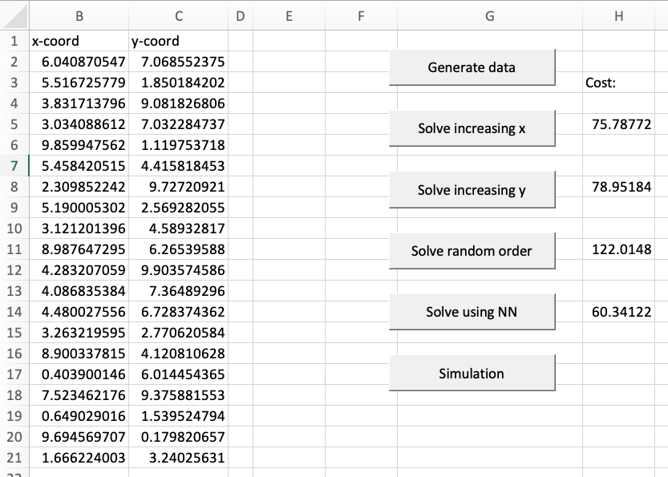
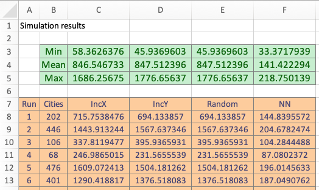

```{r, code = readLines("common.R"), cache = FALSE, include=FALSE}
```

```{r, include=FALSE}
module_number_prefix <- "06"
module_number <- as.numeric(module_number_prefix)
module_name <- "vba-random-numbers"
here::i_am(str_c("book/", module_number_prefix, "_", module_name, ".Rmd"))
# module_name_underscore <- str_replace_all(module_name, "-", "_")
sheet_name_prefix <- str_c("TM", module_number)
```


# Generating random numbers {#mod-vba-random-numbers}

This module gives a short introduction on how to generate random numbers and using them in a simulation. Simulation studies that you do in Excel may be done easier using VBA together with Excel. For more advanced simulation studies you may use dedicated programs (such as Arena) or Excel plugins (such as \@Risk).

```{r, echo=FALSE}
link_excel_file_text(module_number_prefix, module_name)
```

#### Learning path diagram {-}

Click/hover the nodes to follow links and see details.

```{r, echo=FALSE, out.width="100%", fig.asp=NA}
g <- create_learning_path(
   url = "https://docs.google.com/spreadsheets/d/1bBe42LHK-bE7CsU9eNBzi_7VNjbmv-Ybr7285pE61jM/edit?usp=sharing", 
   sheet = "vba-random-numbers", 
   x_legend = NULL)
render_graph(g, height =100)
```

## Learning outcomes {#lo-vba-random-numbers}

By the end of this module, you are expected to be able to:

* Describe what a random number is.
* Generate a random number from a distribution.
* Run a simulation and compare/analyse results.


The learning outcomes relate to the [overall learning goals](#lg-course) number 2-4, 8-14 and 16 of the course.

<!-- SOLO increasing: identify · memorise · name · do simple procedure · collect data · -->
<!-- enumerate · describe · interpret · formulate · list · paraphrase · combine · do -->
<!-- algorithms · compare · contrast · explain causes · analyse · relate · derive · -->
<!-- evaluate · apply · argue · theorise · generalise · hypothesise · solve · reflect -->


## Generating random numbers {#vba-random-numbers}

Often we want to model a system where some of the elements are uncertain. To simulate the system we want to generate some random numbers following different distributions. This can be done using the built-in VBA and Excel functions for most distributions. The [course procedures](#vba-course-procedures) (module *ModRand*) contain a set of procedures for generating random numbers. Let us have a look at how to generate random numbers from a continuous uniform distribution:

```
'' Generate a random number from a continuous uniform distribution
' @param dblMin Minimum number.
' @param dblMax Maximum number (not included).
Function RandInvUniformCont(dblMin As Double, dblMax As Double) As Double
    RandInvUniformCont = dblMin + (dblMax - dblMin) * Rnd()
End Function
```

Here a single random number is returned. The `Rnd` function is used to generate random numbers in the interval $[0,1[$, i.e. a continuous uniform distribution. The `Rnd` function is a built-in VBA function. To generate random numbers between [`dblMin`, `dblMax`[, we use the formula `dblMin + (dblMax - dblMin) * Rnd()`. 

If you need more than a single random number, you can use the almost same procedure with `Gen` in its name instead of `Inv`:

```
'' Generate random numbers from a continuous uniform distribution
' @param intSize Random numbers generated
' @param dblMin Minimum number.
' @param dblMax Maximum number (not included).
' @param ary Array to store the values in.
Sub RandGenUniformCont(intSize As Integer, dblMin As Double, dblMax As Double, ary() As Double)
    Dim i As Integer
    ReDim ary(intSize) As Double
    
    For i = 1 To intSize
        ary(i) = dblMin + (dblMax - dblMin) * Rnd()
    Next
End Sub
```

The difference is that an array `ary` of `intSize` is used to store the random numbers. 

Let us consider another example, the normal distribution:

```
'' Generate a random number from a normal distribution
' @param dblMean Mean.
' @param dblSD Standard deviation.
Function RandInvNormal(dblMean As Double, dblSD As Double) As Double
    RandInvNormal = Application.WorksheetFunction.NormInv(Rnd, dblMean, dblSD)
End Function
```

The procedure takes the mean and standard deviation as arguments and return a random number. Multiple random numbers are found using:

```
'' Generate random numbers from a normal distribution
' @param intSize Random numbers generated
' @param dblMean Mean.
' @param dblSD Standard deviation.
' @param ary Array to store the values in.
Sub RandGenNormal(intSize As Integer, dblMean As Double, dblSD As Double, ary() As Double)
    Dim i As Integer
    ReDim ary(intSize) As Double
    
    For i = 1 To intSize
        ary(i) = Application.WorksheetFunction.NormInv(Rnd, dblMean, dblSD)
    Next
End Sub
```

Here `intSize` random numbers in stored in the output array `ary`. 

Similar procedures can be found for the uniform (discrete), binomial, poisson and a custom discrete distribution. Let us try some examples:

```
Sub TM6_RandDistEx()
    Dim aryDens() As Double

    Randomize    ' initialize random-number generator
    MsgBox ("Normal: " & RandInvNormal(100, 20))
    ' Cont. uniform [10,500[
    MsgBox ("Uniform (continuous): " & RandInvUniformCont(10, 500))
    ' Discrete uniform 10,...,500
    MsgBox ("Uniform (discrete): " & RandInvUniformDisc(10, 500))
    ' Binomial 100 trials, pr = 0.2
    MsgBox ("Binomial: " & RandInvBinomial(100, 0.2))
    ' Poisson lambda = 5
    MsgBox ("Poisson: " & RandInvPoisson(5))
    ' Custom discrete
    ReDim aryDens(1 To 4, 1 To 2)
    aryDens(1, 1) = 3
    aryDens(2, 1) = 4
    aryDens(3, 1) = 5
    aryDens(4, 1) = 6
    aryDens(1, 2) = 0.1
    aryDens(2, 2) = 0.3
    aryDens(3, 2) = 0.5
    aryDens(4, 2) = 0.1
    MsgBox ("Custom (discrete): " & RandInvDiscrete(aryDens))
End Sub
```

First, observe that in the start of the procedure, the `Randomize` procedure is called. `Randomize` initialize the random-number generator and it is always a good idea to call it if you want true random numbers. Next we generate a random number from the different distributions. For generating random numbers from a custom discrete distribution we need a 2D array where each row store the outcome and the probability. For instance here the probability of outcome 5 is 50%. 

Let us try to generate 20 random numbers from each distribution:

```
Sub TM6_RandDistAryEx()
    Dim ary() As Double
    Dim aryDens() As Double
    Dim intSize As Integer
    
    ThisWorkbook.Worksheets("TM6").Activate
    Call TM6_ClearTestTM6
    Randomize    ' initialize random-number generator
    intSize = 20 ' generate 20 numbers for each distribution
    ' Normal
    Call RandGenNormal(intSize, 100, 20, ary)
    Range("A1") = "Normal"
    Call AryPaste(ary, Range("A2"), False)
    ' Cont. uniform [10,500[
    Call RandGenUniformCont(intSize, 10, 500, ary)
    Range("B1") = "Uniform"
    Call AryPaste(ary, Range("B2"), False)
    ' Discrete uniform 10,...,500
    Call RandGenUniformDisc(intSize, 10, 500, ary)
    Range("B1") = "Uniform"
    Call AryPaste(ary, Range("B2"), False)
    ' Binomial 100 trials, pr = 0.2
    Call RandGenBinomial(intSize, 100, 0.2, ary)
    Range("C1") = "Binomial"
    Call AryPaste(ary, Range("C2"), False)
    ' Poisson lambda = 5
    Call RandGenPoisson(intSize, 5, ary)
    Range("D1") = "Poisson"
    Call AryPaste(ary, Range("D2"), False)
    ' Custom discrete
    ReDim aryDens(1 To 4, 1 To 2)
    aryDens(1, 1) = 3
    aryDens(2, 1) = 4
    aryDens(3, 1) = 5
    aryDens(4, 1) = 6
    aryDens(1, 2) = 0.1
    aryDens(2, 2) = 0.3
    aryDens(3, 2) = 0.5
    aryDens(4, 2) = 0.1
    Call RandGenDiscrete(intSize, aryDens, ary)
    Range("E1") = "Custom"
    Call AryPaste(ary, Range("E2"), False)
    Range("G3") = "Custom distribution:"
    Range("G4") = "Value"
    Range("H4") = "Prob."
    Call AryPaste(aryDens, Range("G5"))
End Sub
```


## Simulation {#vba-simulation}

Given an uncertain system we simulate the system by:

   1) Constructing a deterministic model (that is we assume the random numbers have some specific values) and algorithms for solving it. 
   2) Generate random numbers and use them to solve the model and store the results. 
   3) Repeat a number of times and gather statistics such as minimum, mean, standard deviation or maximum value.

Let us consider some examples in the next sections.


### Example - Traveling salesman problem {#sec-vba-tsp}

The [travelling salesman problem](https://en.wikipedia.org/wiki/Travelling_salesman_problem) (TSP) asks the following question: 

> Given a list of cities and the distances between each pair of the cities, 
> what is the shortest possible route that visits each city exactly once 
> and returns to the origin city?

The problem is an NP-hard problem (worst case solution time grows exponential with the number of cities) in combinatorial optimization, important in theoretical computer science and operations research. The problem was first formulated in 1930 and is one of the most intensively studied problems in optimization. Even though the problem is computationally difficult, many heuristics and exact algorithms are known. 

The goal with this example is to test different heuristics on a set of problem instances. To see which one works best.

Let us first create a procedure `TM6_GenTSPData` that generate a TSP instance:

```
'' Generate cities for the TSP (a TSP problem instance)
' @param dblCoord A (cities x 3) array to store the generated id and coordinates in (output ByRef).
' @param intCities Number of cities to generate. If 0 then ask.
' @param blnPrint If true then print out the data in columns A:C in the TM6_TSP sheet.
Sub TM6_GenTSPData(dblCoord() As Double, Optional intCities As Integer = 0, _
                       Optional blnPrint As Boolean = False)
    Dim dblMin As Double
    Dim dblMax As Double
    Dim i As Integer
    Dim ary1() As Double, ary2() As Double
    
    Randomize
    ' Min and max values for uniform distribution
    dblMin = 0
    dblMax = 10
    ' Reallocate
    If intCities = 0 Then intCities = InputBox("How many points should I generate?")
    ReDim dblCoord(1 To intCities, 1 To 3)
    ' Generate random numbers
    Call RandGenUniformCont(intCities, dblMin, dblMax, ary1)
    Call RandGenUniformCont(intCities, dblMin, dblMax, ary2)
    For i = 1 To intCities
        dblCoord(i, 1) = i
        dblCoord(i, 2) = ary1(i)
        dblCoord(i, 3) = ary2(i)
    Next
    '' Print data
    If blnPrint Then
        ThisWorkbook.Worksheets("TM6_TSP").Activate
        Call TM6_ClearTestTSP
        Cells(1, 1).value = "City"
        Cells(1, 2).value = "x-coord"
        Cells(1, 3).value = "y-coord"
        For i = 1 To intCities
            Cells(i + 1, 1).value = dblCoord(i, 1)
            Cells(i + 1, 2).value = dblCoord(i, 2)
            Cells(i + 1, 3).value = dblCoord(i, 3)
        Next
    End If
End Sub
```

Note we specify the number of cities as an input argument. Each city has an id number and a $x$ and $y$-coordinate and the result is stored in array `dblCoord` with `intCities` rows and three columns (column 1 store the city id, column 2 the $x$-coordinate and column 3 the $y$-coordinate). The $x$ and $y$-coordinates are random numbers from an uniform distribution between 0 and 10. If `blnPrint` is true then coordinates are printed to the sheet and if `intCities` is zero then use an input box to ask for the number of cities. 

```{r tm6-tsp, echo = FALSE, out.width="600px", fig.cap="TSP algorithms and cost (*TM6_TSP* worksheet)."} 
 
```

We now can create a procedure `BtnGenTSPData` that calls `GenTSPData`, ask for the number of cities and print the result to the sheet. A button linking to the procedure is made in worksheet *TM6_TSP* (see Figure \@ref(fig:tm6-tsp)):

```
Sub TM6_BtnGenTSPData()
    Dim dblCoord() As Double
    Call TM6_GenTSPData(dblCoord, 0, True)
End Sub
```

Given the $x$ and $y$-coordinates of a problem instance (stored in `dblCoord`) we need to calculate the distance matrix:

```
'' Calculate distance matrix
' @param dblDist The distance matrix to store distances (output ByRef).
' @param dblCoord A (cities x 3) array with id and coordinates.
' @pre Assume that dblCoord has not been sorted yet!
' @post Distances stored in dblDist.
Sub TM6_CalcDistArray(ByRef dblDist() As Double, dblCoord() As Double)
    Dim i As Integer, j As Integer
    Dim dblDiffX As Double, dblDiffY As Double
    Dim intCities As Integer
    
    intCities = UBound(dblCoord, 1)
    ReDim dblDist(intCities, intCities)
    For i = 1 To intCities
        For j = i + 1 To intCities
            dblDiffX = dblCoord(i, 2) - dblCoord(j, 2)
            dblDiffY = dblCoord(i, 3) - dblCoord(j, 3)
            dblDist(i, j) = Sqr((dblDiffX * dblDiffX) + (dblDiffY * dblDiffY))
            dblDist(j, i) = dblDist(i, j)  ' assume symetric
        Next
    Next
End Sub
```

The procedure takes the $x$ and $y$-coordinates (stored in `dblCoord`) and calculate the distance matrix stored in `dblDist`, i.e. `dblDist(i, j)` store the euclidean distance between city `i` and `j`. Symmetric distances are assumed, i.e. `dblDist(i, j) = dblDist(j, i)`.

We are now ready to consider algorithms for calculating a TSP route. Let us first consider a procedure `TM6_SolveTSPIncX` that sort the array `dblCoord` increasing in the x-coordinate and visit the cities in the order of the sorted array and return to the starting city:

```
'' Calculate visiting sequence based on increasing x-coord
' @param dblCoord A (cities x 3) array with id and coordinates.
' @param dblDist The distance matrix.
' @param dblCost Total cost (output ByRef).
' @param intSeq The visiting sequence (output ByRef).
' @post The total cost and sequence returned.
 Sub TM6_SolveTSPIncX(dblCoord() As Double, dblDist() As Double, _
                      dblCost As Double, intSeq() As Integer)
    Dim j As Integer
    Dim intCities As Integer
    
    ' Sort
    intCities = UBound(dblDist, 1)
    ReDim intSeq(intCities)
    Call AryQuickSort(dblCoord, 2)
    ' Store visiting sequence
    For j = 1 To intCities
        intSeq(j) = dblCoord(j, 1)
    Next
    dblCost = TM6_CalcCost(dblDist, intSeq)
End Sub
```

First, observe that we sort the array using course procedure `ArySort`. Next, the visiting city sequence are stored in `intSeq`. Finally, the total cost are stored in `dblCost` which call the function `TM6_CalcCost`:

```
'' Calculate the cost of a route
' @param dblDist The distance matrix.
' @param intSeq The visiting sequence (output ByRef).
' @return The cost of a route.
Function TM6_CalcCost(dblDist() As Double, intSeq() As Integer) As Double
    Dim dblCost As Double
    Dim intCities As Integer
    Dim j As Integer
    
    intCities = UBound(intSeq)
    dblCost = 0
    For j = 1 To intCities - 1
        dblCost = dblCost + dblDist(intSeq(j), intSeq(j + 1))
    Next
    TM6_CalcCost = dblCost + dblDist(intSeq(intCities), intSeq(1))   ' cost + cost of returning to start
End Function
```

If we want to use the algorithm on the data in sheet *TM6_TSP* we first need a procedure reading the data:

```
'' Read the coordinates into an 2D array
' @param dblCoord A (cities x 3) array to store the generated id and coordinates in.
' @post Generated data stored in dblCoord.
Sub TM6_ReadCoord(dblCoord() As Double)
    Dim rng As Range
    
    ThisWorkbook.Worksheets("TM6_TSP").Activate
    Set rng = RngGetCurRegionRange(Range("A1"), 2) 'current region except the header
    Call AryRead(dblCoord, rng)
End Sub
```

and then a procedure `TM6_BtnSolveTSPIncX` that calls `TM6_SolveTSPIncX` using the TSP data in the sheet and print out the total cost in cell H4. We include a button linking to the procedure (see Figure \@ref(fig:tm6-tsp)):

```
Sub TM6_BtnSolveTSPIncX()
    Dim dblCoord() As Double
    Dim dblDist() As Double
    Dim intSeq() As Integer
    Dim dblCost As Double
    
    Call TM6_ReadCoord(dblCoord)
    Call AryQuickSort(dblCoord, 1)  ' so sure sorted by id
    Call TM6_CalcDistArray(dblDist, dblCoord)
    Call TM6_SolveTSPIncX(dblCoord, dblDist, dblCost, intSeq)
    Range("H3") = "Cost:"
    Range("H5") = dblCost
End Sub
```

Another algorithm `TM6_SolveTSPIncY` that sort the array `dblCoord` increasing in the $y$-coordinate and visit the cities in the order of the sorted array and return to the starting city can be made similar to above (see Figure \@ref(fig:tm6-tsp)). A possibility is also an algorithm that visit the cities in the order of the `dblCoord` array and return to the starting city. This may seen as we visit the cities in random order since we generate the $x$ and $y$-coordinate random.

Finally, we will consider a nearest neighbour algorithm. We start in City 1. Given the current city, the next city (not already visited) is the city with the shortest distance:

```
'' Calculate visiting sequence based on nearest neighbour
' @param dblCoord A (cities x 3) array with id and coordinates.
' @param dblDist The distance matrix.
' @param dblCost Total cost.
' @param intSeq The visiting sequence.
' @post The total cost and sequence returned.
 Sub TM6_SolveTSPNN(dblCoord() As Double, dblDist() As Double, ByRef dblCost As Double, ByRef intSeq() As Integer)
    Dim i As Integer, id As Integer
    Dim intCities As Integer, intCurCity As Integer, intBestCity As Integer
    Dim dblMinDist As Double
    Dim intUsed() As Integer       ' intUsed(id) = 1 if city id have been used in sequence
    
    intCities = UBound(dblDist, 1)
    ReDim intSeq(intCities)
    ReDim intUsed(intCities)
    ' Find nearst neighbor
    id = 1
    intSeq(1) = id  ' start in city id = 1
    intUsed(id) = 1
    For i = 2 To intCities        ' find next city to add to intSeq(i)
        dblMinDist = 1000000      ' large number
        intCurCity = intSeq(i - 1)
        For id = 2 To intCities   ' scan for next candidate (id = 1 already used)
            If intUsed(id) = 0 And dblDist(intCurCity, id) < dblMinDist Then   ' shorter distance found
                intBestCity = id
                dblMinDist = dblDist(intCurCity, id)
            End If
        Next
        intSeq(i) = intBestCity
        intUsed(intBestCity) = 1
    Next
    dblCost = TM6_CalcCost(dblDist, intSeq)
End Sub
```

Here we need to have an array `intUsed` to store if a city already visited (equal 1 if yes). Nested loops is used to scan for the not-visited city nearest to the current one. The results for all the algorithms on an problem instance with 20 cities can be seen in Figure \@ref(fig:tm6-tsp).

We now have a set of algorithms which can be tested on some problem instances that we can generate. On the problem instance we used above the nearest neighbour algorithm seems to find the best route (shortest cost). However, we can not state that this holds in general without testing on many problem instances. Hence we want to do a simulation study with steps:

- Generate a problem instance with `intCities` cities which are chosen random between 10 and 500.
- Calculate the distance matrix.
- Solve the instance using all of the above algorithms.
- Store the result in a row in the *TM6_TSPSim* sheet. 
- Repeat 100 times and calculate min, mean and max values for each solution algorithm.

This is done in procedure `TM6_TSPSim`:

```
Sub TM6_TSPSim()
    Dim intCities As Integer
    Dim s As Integer
    Dim dblCoord() As Double
    Dim dblDist() As Double
    Dim intSeq() As Integer
    Dim dblCost As Double
    Dim intRow As Integer
    
    ' Setup sheet
    ThisWorkbook.Worksheets("TM6_TSPSim").Activate
    Call RngClear(Range("A:F"))
    Cells(1, 1) = "Simulation results"
    Cells(3, 2) = "Min"
    Cells(4, 2) = "Mean"
    Cells(5, 2) = "Max"
    intRow = 7
    Cells(intRow, 1) = "Run"
    Cells(intRow, 2) = "Cities"
    Cells(intRow, 3) = "IncX"
    Cells(intRow, 4) = "IncY"
    Cells(intRow, 5) = "Random"
    Cells(intRow, 6) = "NN"
    ' Run simulation
    For s = 1 To 100
        Cells(s + intRow, 1) = s
        intCities = WorksheetFunction.RandBetween(10, 500) ' number of cities
        Cells(s + intRow, 2) = intCities
        Call TM6_GenTSPData(dblCoord, intCities, False)
        Call TM6_CalcDistArray(dblDist, dblCoord)
        Call TM6_SolveTSPIncX(dblCoord, dblDist, dblCost, intSeq)
        Cells(s + intRow, 3) = dblCost
        Call TM6_SolveTSPIncY(dblCoord, dblDist, dblCost, intSeq)
        Cells(s + intRow, 4) = dblCost
        Call TM6_SolveTSPRand(dblCoord, dblDist, dblCost, intSeq)
        Cells(s + intRow, 5) = dblCost
        Call TM6_SolveTSPNN(dblCoord, dblDist, dblCost, intSeq)
        Cells(s + intRow, 6) = dblCost
    Next
    ' Calc statistics
    For s = 3 To 6
        Cells(3, s) = WorksheetFunction.Min(Range(Cells(intRow + 1, s), Cells(intRow + 100, s)))
        Cells(4, s) = WorksheetFunction.Average(Range(Cells(intRow + 1, s), Cells(intRow + 100, s)))
        Cells(5, s) = WorksheetFunction.Max(Range(Cells(intRow + 1, s), Cells(intRow + 100, s)))
    Next
    ' Format cells
    Call RngFormat(Cells(3, 2).CurrentRegion, "green")
    Call RngFormat(Cells(intRow, 1).CurrentRegion, "orange", True)
End Sub
```

First, we setup the worksheet *TM6_TSPSim* so it is ready for the results. Next, we run the simulation 100 times in a for loop. In each loop we first generate the number of instances, then a problem instance for which we find the distance matrix. The algorithms is then run on the problem instance and results are added to the worksheet. After the loop we calculate statistics for all the runs. Finally, the results are formatted for nice appearance. 

```{r tm6-tsp-sim, echo = FALSE, out.width="600px", fig.cap="Simulation comparing TSP algorithms (*TM6_TSPSim* worksheet)."} 
 
```
       
The results are given in Figure \@ref(fig:tm6-tsp-sim). As can be seen the nearest naighbour algorith is best and gives the shortest average distance.  


## Recap

- Often we want to model a system where some of the elements are uncertain. To simulate the system we want to generate some random numbers following different distributions. This can be done using the built-in VBA and Excel functions for most distributions. 
- Initialize generation of random numbers using 
  ```
  Randomize()     ' chooses a random seed 
  ```
  Or
  ```
  Randomize(100)     ' generate the same sequence of random numbers
  ```
  We normally use the first option.
- When generating random numbers in VBA and writing them to the worksheet, they will NOT be changed when the worksheet is updated! Only when the code is executed!
- The [course procedures](#vba-course-procedures) (module *ModRand*) also contain a set of procedures for generating random numbers that are stored in an array. 
- Given an uncertain system we simulate the system by:
   1) Constructing a deterministic model (that is we assume the random numbers have some specific values) and algorithms for solving it. 
   2) Generate random numbers and use them to solve the model and store the results. 
   3) Repeat a number of times and gather statistics such as minimum, mean, standard deviation or maximum value.

```{r, echo=FALSE}
link_slide_file_text(module_number_prefix, module_name)
```

## Exercises {#ex-vba-random-numbers}

`r strExercises`

```{r, echo=FALSE}
link_excel_file_text(module_number_prefix, module_name)
```


### Exercise - Two random integers {#ex-vba-random-int}

*This exercise is a slightly modified version an exam assignment (reexam 2021-A4).*

Consider worksheet *TM6*.

   (1) Write a sub `TM6_RandInt1` that reads two integer numbers, $a$ and $b$ (assume that $a < b$) from cells B24 and B25, and generates two random integer numbers, $r_1$ and $r_2$, uniformly between $a$ and $b$ such that $r_1 \neq r_2$. The sub should write $r_1$ and $r_2$ in cells D24 and D25 with the smaller of the two numbers in D24.

   (2) Write a sub `TM6_RandInt2` that should take two integer arguments, $a$ and $b$, and generate two random numbers $r_1$ and $r_2$ following the same rules as in Question 1. However, $r_1$ and $r_2$ may not be written to the spreadsheet. Instead, they should be given as output to the sub calling `TM6_RandInt2`. 
   
   (3) Write a sub `TM6_RandInt2Main` that call `TM6_RandInt2` using $a=2$ and $b=17$ and output $r_1$ and $r_2$ in a message box.
   
   (4) Is your code robust? What happens if $a=b$?
   
   
### Exercise - Swap entries {#ex-vba-swap}

*This exercise is a slightly modified version an exam assignment (reexam 2021-A5).*

Consider worksheet *TM6_Swap* which contains a list of names (from A4) and two numbers between 1 and 20 (in B1 and B2). You may assume that the number in B2 is strictly larger than the one in B1. In the following, let $r_1$ and $r_2$ represent these two numbers. Sometimes, we need to change the order of the items in such lists, and in this assignment, you will be asked to do that in three different ways. 

   (1) Write a sub `TM6_Swap1` that, given values of $r_1$ and $r_2$ (to be read from B1 and B2), swaps the $r_1$‘th and the $r_2$’th name in the list. Print the result in column D.
   
   (2) Write a sub `TM6_Swap2` that, given values of $r_1$ and $r_2$ (to be read from B1 and B2), reverses the sequence from the $r_1$‘th to the $r_2$’th name in the list. Print the result in column E.
  
   (3) Write a sub `TM6_Swap3` that changes the order of the names so they appear in random order. Print the result in column F. 

Figure \@ref(fig:exc-swap) gives an example on the swap operations.

```{r exc-swap, echo = FALSE, out.width="500px", fig.cap="Swap entries (*TM6_Swap* worksheet)."} 
knitr::include_graphics("./img/exc-swap.png") 
```

  
### Exercise - Dan's bakery {#ex-vba-bakery}

Dan owns a small bakery baking a single cold-rised bread. The demand level $l$ for bread is uncertain and on a given day the demand level equals $l=1$ (low) with probability 0.2, $l=2$ (medium) with probability 0.5 and $l=3$ (high) with probability 0.3. The actual demand (number of customers) depends on the demand level and is Poisson distributed with mean $50 + 60l$. 

Currently, the sales price per bread is 45 DKK and production cost 7 DKK. If a customer arrives and Dan has no bread left then he estimates the loss of goodwill to be 10 DKK. 

A customer always buy one bread. Dan can have 20 breads in the oven a time and hence always produce a multiple of 20 breads.

   (1) Create a function `TM6_DanProfit` that returns the daily profit given a specific demand and production. The profit given demand $d$ and production $p$ using the current prices and costs is $$(45-7)\min(d,p) - 7\max(0,p-d) - 10\max(0,d-p).$$ Let the arguments of the function be:
   
       ```
       ' @param dblDemand Demand.
       ' @param dblProd Production.
       ' @param dblPrice Sales price.
       ' @param dblCost Production costs.
       ' @param dblGW Lost goodwill cost.
       ```

   (2) Create a procedure `TM6_DanSim` that simulate the system for $y$ days given that Dan choose to produce $x$ breads each day. The procedure arguments are:
   
       ```
       ' @param dblProd Production (x).
       ' @param dblPrice Sales price.
       ' @param dblCost Production costs.
       ' @param dblGW Lost goodwill cost.
       ' @param aryDens Demand level density array (needed for RandGenDiscrete).
       ' @param intDays Days to simulate (y).
       ' @param aryStat Array to store the output statistics (output ByRef).
       ```
   
       The result array `aryProfit` has entries:
       * number of runs (days), 
       * production
       * sales price
       * production cost
       * lost goodwill cost
       * average profit
       * standard deviation
       * min and max profit 
       
   (3) Create a procedure `TM6_DanBtnSim` that calls `TM6_DanSim` for production levels 20, 40, ..., 400 and output the results in worksheet _TM6_DanSim_. The procedure must use the demand level distribution, prices and cost given in the worksheet.
   
   (4) What is the best production level?
   
   (5) What is the best production level if the demand levels changes to low with probability 0.7, medium with probability 0.2 and high with probability 0.1?


### Exercise - Generating random numbers {#ex-vba-generate}

Create a procedure `TM6_GenRandNumb` that generate 5000 random numbers of 

   - A normal distribution with mean 100 and standard deviation 20.
   - An continuous uniform distribution with range 10 to 500.
   - A binomial distribution with 100 trials and a 0.2 probability of success.
   - A poisson distribution with mean 5.
   - Plot the results for each distribution using `TM6_PlotFreq` (given).


  
  
```{r links, child="links.md", include=FALSE}
```

<script src="//unpkg.com/@highlightjs/cdn-assets@11.5.1/highlight.min.js"></script>
<script type="text/javascript" src="https://unpkg.com/highlightjs-vba/dist/vba.min.js"></script>
<!-- <script src="//cdnjs.cloudflare.com/ajax/libs/highlightjs-line-numbers.js/2.8.0/highlightjs-line-numbers.min.js"></script> -->
<script type="text/javascript">
  hljs.initHighlightingOnLoad();
  // hljs.initLineNumbersOnLoad({singleLine: true}); 
</script>