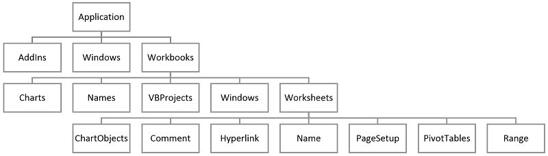

# Object model {#mod-vba-object-model}

This module gives a short introduction to the object model. In general syllabus will point to chapters in @vba-book; however, there is a lot for videos about VBA online such as course [14-Hour VBA Course][vba-yt-course2]. You may have a look at these videos instead if you prefer a different learning style. In the learning path diagram, links to alternative online content will be pointed out. Note this is alternatives to the standard learning path that you may use instead. The learning path may also have extra content that is not a part of syllabus you can have a look at.

__Learning path diagram__

Click/hover the nodes to follow links and see details.


```{=html}
<div id="htmlwidget-9d68bbff2bd3c44cdc63" style="width:100%;height:400px;" class="grViz html-widget"></div>
<script type="application/json" data-for="htmlwidget-9d68bbff2bd3c44cdc63">{"x":{"diagram":"digraph {\n\ngraph [layout = \"neato\",\n       outputorder = \"edgesfirst\",\n       bgcolor = \"white\"]\n\nnode [fontname = \"Helvetica\",\n      fontsize = \"10\",\n      shape = \"circle\",\n      fixedsize = \"true\",\n      width = \"0.5\",\n      style = \"filled\",\n      fillcolor = \"aliceblue\",\n      color = \"gray70\",\n      fontcolor = \"gray50\"]\n\nedge [fontname = \"Helvetica\",\n     fontsize = \"8\",\n     len = \"1.5\",\n     color = \"gray80\",\n     arrowsize = \"0.5\"]\n\n  \"1\" [label = \"📖 The object model\", URL = \"#vba-object-model\", tooltip = \"The object model\", style = \"filled\", fixedsize = \"FALSE\", fontsize = \"11\", fontcolor = \"white\", penwidth = \"2\", fontname = \"Helvetica-bold\", shape = \"rect\", margin = \"0.2\", width = \"0.5\", fillcolor = \"DarkSeaGreen4\", pos = \"2,1!\"] \n  \"2\" [label = \"💻 Exercises\", URL = \"#ex-vba-object-model\", tooltip = \"Exercises\", style = \"filled\", fixedsize = \"FALSE\", fontsize = \"11\", fontcolor = \"white\", penwidth = \"2\", fontname = \"Helvetica-bold\", shape = \"egg\", margin = \"0.2\", width = \"0.5\", fillcolor = \"DarkSeaGreen4\", pos = \"6,1!\"] \n  \"3\" [label = \"🎬 The object browser\", URL = \"https://youtu.be/rd1QSLDBrnc\", tooltip = \"The object browser\", style = \"filled\", fixedsize = \"FALSE\", fontsize = \"11\", fontcolor = \"white\", penwidth = \"2\", fontname = \"Helvetica-bold\", shape = \"rect\", margin = \"0.2\", width = \"0.5\", fillcolor = \"PeachPuff3\", pos = \"2,2!\"] \n  \"4\" [label = \"🎬 Object Variables\", URL = \"https://youtu.be/qGWiiLmMA_A\", tooltip = \"Object Variables\", style = \"filled\", fixedsize = \"FALSE\", fontsize = \"11\", fontcolor = \"white\", penwidth = \"2\", fontname = \"Helvetica-bold\", shape = \"rect\", margin = \"0.2\", width = \"0.5\", fillcolor = \"PeachPuff3\", pos = \"2,3!\"] \n  \"5\" [label = \"🎬 Memory usage of objects\", URL = \"https://youtu.be/-sj0vvYT-Mk\", tooltip = \"Memory usage of objects\", style = \"filled\", fixedsize = \"FALSE\", fontsize = \"11\", fontcolor = \"white\", penwidth = \"2\", fontname = \"Helvetica-bold\", shape = \"rect\", margin = \"0.2\", width = \"0.5\", fillcolor = \"PeachPuff3\", pos = \"4.5,2!\"] \n  \"6\" [label = \"\", URL = \"\", tooltip = \" \", style = \"filled\", fixedsize = \"true\", fontsize = \"9\", fontcolor = \"white\", penwidth = \"0.5\", fontname = \"Helvetica\", shape = \"rect\", height = \"1\", width = \"6\", fillcolor = \"#F0F8FF\", pos = \"4.1,4.16!\"] \n  \"7\" [label = \"Color:\", URL = \"\", tooltip = \" \", style = \"filled\", fixedsize = \"true\", fontsize = \"9\", fontcolor = \"black\", penwidth = \"0\", fontname = \"Helvetica\", shape = \"none\", height = \"0\", width = \"0.8\", fillcolor = \"#FFFFFE\", pos = \"1.47,4.5!\"] \n  \"8\" [label = \"mandatory\", URL = \"\", tooltip = \"Mandatory syllabus.\", style = \"filled\", fixedsize = \"true\", fontsize = \"9\", fontcolor = \"white\", penwidth = \"2\", fontname = \"Helvetica\", shape = \"rect\", width = \"0.8\", fillcolor = \"DarkSeaGreen4\", pos = \"1.7,4.1!\"] \n  \"9\" [label = \"alternative\", URL = \"\", tooltip = \"Alternative syllabus if you prefer another learning style.\", style = \"filled\", fixedsize = \"true\", fontsize = \"9\", fontcolor = \"white\", penwidth = \"2\", fontname = \"Helvetica\", shape = \"rect\", width = \"0.8\", fillcolor = \"DarkOrange4\", pos = \"2.7,4.1!\"] \n  \"10\" [label = \"extra\", URL = \"\", tooltip = \"Extra learning if you are interested (not part of syllabus).\", style = \"filled\", fixedsize = \"true\", fontsize = \"9\", fontcolor = \"white\", penwidth = \"2\", fontname = \"Helvetica\", shape = \"rect\", width = \"0.8\", fillcolor = \"PeachPuff3\", pos = \"3.7,4.1!\"] \n  \"11\" [label = \"Shape:\", URL = \"\", tooltip = \" \", style = \"filled\", fixedsize = \"true\", fontsize = \"9\", fontcolor = \"black\", penwidth = \"0\", fontname = \"Helvetica\", shape = \"none\", height = \"0\", width = \"1\", fillcolor = \"#FFFFFE\", pos = \"4.9,4.5!\"] \n  \"12\" [label = \"non-interactive\", URL = \"\", tooltip = \"Non-interactive learning content (e.g. reading).\", style = \"filled\", fixedsize = \"true\", fontsize = \"9\", fontcolor = \"white\", penwidth = \"2\", fontname = \"Helvetica\", shape = \"rect\", width = \"1\", fillcolor = \"Grey40\", pos = \"5.2,4.1!\"] \n  \"13\" [label = \"interactive\", URL = \"\", tooltip = \"Interactive learning content (tutorial, exercises etc.).\", style = \"filled\", fixedsize = \"true\", fontsize = \"9\", fontcolor = \"white\", penwidth = \"2\", fontname = \"Helvetica\", shape = \"egg\", width = \"1\", fillcolor = \"Grey40\", pos = \"6.45,4.1!\"] \n\"1\"->\"2\" [color = \"black\", arrowhead = \"vee\"] \n\"1\"->\"3\" [color = \"black\", arrowhead = \"vee\"] \n\"1\"->\"5\" [color = \"black\", arrowhead = \"vee\"] \n\"3\"->\"4\" [color = \"black\", arrowhead = \"vee\"] \n}","config":{"engine":"dot","options":null}},"evals":[],"jsHooks":[]}</script>
```

## Learning outcomes {#lo-vba-object-model}

By the end of this module, you are expected to be able to:

* Describe what the object model is.
* Declare and set an object.
* Explain what a collection of objects are. 
* Add and delete worksheets.
* Understand what a range is and extract properties about it such as rows, start row, address, start column etc. 
* Use the current region of a range to get information about the size for data.
* Sort a range.
* Use a `For Each` loop to iterate though a collection of objects. 

The learning outcomes relate to the [overall learning goals](#lg-course) number 1, 2, 4, 8 and 9-12 of the course.

<!-- SOLO increasing: identify · memorise · name · do simple procedure · collect data · -->
<!-- enumerate · describe · interpret · formulate · list · paraphrase · combine · do -->
<!-- algorithms · compare · contrast · explain causes · analyse · relate · derive · -->
<!-- evaluate · apply · argue · theorise · generalise · hypothesise · solve · reflect -->


## Object model {#vba-object-model}

The object model is a big hierarchy of all the predefined objects you can use in VBA. Examples of some objects are `Range`, `Worksheet`, and `WorksheetFunction`. Think of an object as a reference to a datatype that holds a group of variables.

Read Chapter 7 in @vba-book. You may also have a look at the extra videos as listed in the learning path diagram.


## Recap

- The object model is a big hierarchy of all the predefined objects you can use in VBA. Examples of some objects are `Range`, `Worksheet`, and `WorksheetFunction`.
- Think of an object as a datatype that holds a group of variables.
- Objects are grouped and can be nested:

<div class="figure" style="text-align: center">

<p class="caption">(\#fig:unnamed-chunk-3)Object model examples</p>
</div>

- Refer to an object by specifying the path in the hierarchy e.g. 
  ```
  Workbooks("Jobs").Worksheets("Data values").Range("D4").value
  ```
- You may skip parts of the path (VBA then uses the current active one):
  ```
  Workbooks("Jobs").Worksheets("Data values").Range("D4").value
  Worksheets("Data values").Range("D4").value
  Range("D4")
  ```
- Warning, you must know which sheet is active. Always specify what you want to be active	
  ```
  Workbooks("Jobs").Worksheets("Data values").Activate  ' activate the sheet
  dbl = Range("D4")
  dbl = SheetData.Range("D4")   ' alternative if the sheet 'Data values' is 
                                ' given the name SheetData in the VBA editor
  ```
- Declare object variables using:
  ```
  Dim rng As Range
  Dim wst As Worksheet
  Dim col as Collection
  ```
- Set a reference to object variables using the keyword `Set`:
  ```
  Set rng = Range("F7")
  Set wst = Worksheets("Data values")
  Set col = Collection
  ```
- You may declare and set in one go using the `New` keyword:
  ```
  Dim col as New Collection  ' col is now an empty collection (0 items)
  ```
- A range represents a cell, a row, a column, or a rectangular selection of cells. 
  ```
  Dim rng As Range
  Set rng = Range("A1:D5")
  rng = 145   ' cell value
  MsgBox rng.Address   ' range address ($A$1:$D$5)
  ```
- The current region of a range is found by expanding the range until all cells surrounding the range is empty
  ```
  rng = Range("D23").CurrentRegion
  ```
  This is useful if don't know the size for data.

- The columns in a range can be [sorted](https://docs.microsoft.com/en-us/office/vba/api/excel.range.sort). For instance sort a range ascending with respect to the second column and next descending with respect to the first column.
  ```
  rng.Sort Key1:=rng.Columns(2), Order1:=xlAscending, _
           Key2:=rng.Columns(1), Order2:=xlDescending, Header:=xlYes
  ```
  Note the way of calling the procedure. You could also write
  ```
  Call rng.Sort(Key1:=rng.Columns(2), Order1:=xlAscending, _
                Key2:=rng.Columns(1), Order2:=xlDescending, Header:=xlYes)
  ```
- A `Worksheet` is part of the `Worksheets` collection. You can add a new worksheet using:
  ```
  Dim wst As Worksheet
  Set wst = ThisWorkbook.Worksheets.Add()  ' add new worksheet to collection Worksheets
  wst.Name = "Test3"                       ' set the name
  ```
- You can delete a worksheet using:
  ```
  For Each wst In Worksheets
      If wst.Name = "Test3" Then ' Delete "Test3"
          wst.Delete
      End If
  Next
  ```
  
- The Application object can be used to
   - Access WorksheetFunctions
   - Turn of screen updating while doing calculations
   - Turn of automatic updating of cells
   - Turn of displaying alerts
   
  Beware this may have some consequences, i.e. always turn these options back to normal when finished calculations

- The `For Each` [loop](https://docs.microsoft.com/en-us/office/vba/language/reference/user-interface-help/for-eachnext-statement) is used to iterate though objects in a collection:
  ```
  For Each wst In Worksheets
      If wst.Name = "Test3" Then ' Delete "Test3"
          wst.Delete
      End If
  Next
  ```
- You may use an `Exit For` statement to exit a `For Each` loop:
  ```
  For Each rng In Range("A1:B5") 
    If IsNumeric(rng.Value) = False Then 
      MsgBox "Cell " & rng.Address & " contains a non-numeric value." 
      Exit For 
    End If 
  Next  
  ```

You may also have a look at the [slides for this module](https://bss-osca.github.io/tfa/slides/02-04_vba-object-model-slides.html).


## Exercises {#ex-vba-object-model}

Below you will find a set of exercises. Always have a look at the exercises before you meet in your study group and try to solve them yourself. Are you stuck, see the [help page](#help). Some of the solutions to each exercise can be seen by pressing the button at each question. Beware, you will not learn by giving up too early. Put some effort into finding a solution!

### Exercise - Worksheets {#ex-vba-worksheets}

The [file](https://github.com/bss-osca/tfa/blob/master/vba/vba-worksheets-template.xlsm) should be used as a starting point for this exercise.

Use the procedure `Main` to test the following questions.

   (1) Have a look at the function `WorksheetExists` and check if a worksheet named _Main_ exists.
   (2) Make a function `WorksheetCreate` that creates a worksheet given an input name (if does not exist in advance) and return true if created and false otherwise. Use the function to create a worksheet named _Testing_.
   (3) Make a function `WorksheetDelete` that deletes a worksheet given an input name (if it exists) and return true if deleted and false otherwise. Use the function to delete the worksheet named _Testing_.
   (4) Make a function `WorksheetRename` that renames a worksheet given input arguments name and a new name (if it exists) and return true if renamed and false otherwise. Use the function to create a worksheet named _Test_ and rename it to _Testing_.
   
You may use the functions in other exercises.


### Exercise - Ranges {#ex-vba-ranges}

The [file](https://github.com/bss-osca/tfa/blob/master/vba/vba-ranges-template.xlsm) should be used as a starting point for this exercise.

Consider the _Data_ worksheet. 

   (1) Have a look at the function `RngFormat` and try to test it in the `Main` procedure: Make range H1:I1 orange, Make range H2:I3 green and Auto fit range H1:I3.
   (2) Define `rng` as range B14:D17 and use a for each loop and `Debug.Print` to print out all its values in the Immediate window. Do the loop scan row wise or column wise?
   (3) Use the [`Count`](https://docs.microsoft.com/en-us/office/vba/api/excel.range.rows) property to count the number of row and columns in the range B14:D17.
   (4) Find the current region of A1 and F6.
   (5) Have a look at the function `GetCurRegionRows` and use it to find the number of rows of the current region of F6?
   (6) Create function `GetCurRegionCols` similar to `GetCurRegionRows` and use it to find the number of columns of the current region of B14?
   (7) Create a function `RngCopyInt` that takes a range with integer values and a dynamic array as arguments and copy the range into the array. Test in on range A1:B10 and use `Print2DArray` to print the array out in the range with upper left cell A26.
   (8) Have a look at the other range functions given. Find the last row of the current region with cell F19. Find the cell address of the lower left cell in the current region with cell D4. Why is it A22?
   (9) Sort, in descending order, the current region containing cell H10 using the first column.

You may use the functions in other exercises.

### Exercise - Collections {#ex-vba-collections}

The [file](https://github.com/bss-osca/tfa/blob/master/vba/vba-collections-template.xlsm) should be used as a starting point for this exercise. You may use the range functions in module `RangeFunc`. 

The _Data_ worksheet contains a list of orders from a shop. You want to create a procedure that can find all orders with profit within a specific range. Consider the procedure `Search`.

   (1) Create a collection `colRow` where each item contains the row number of an order in the _Data_ sheet. Use the order id as key. 
   (2) The _Main_ sheet contains a search range in cells B5:C5. Search your orders for profits satisfying the range and add the order ids to a new collection `colResult`. Use the order ids as keys too.
   (3) Print the orders satisfying the profit range in the _Main_ sheet starting in cell A10. Hint: the collection with row numbers combined with `colResult` may be handy here. Sort the orders increasing in profit. 
   (4) The _Main_ sheet contains an except cells D5. Remove all order ids equal the value in D5 from `colResult`. 
   (5) Print the orders satisfying the profit range and not equal D5 in the _Main_ sheet starting in cell F10. 

### Exercise - Production plan {#ex-vba-production-plan}

The [file](https://github.com/bss-osca/tfa/blob/master/vba/vba-production-plan-template.xlsm) should be used as a starting point for this exercise. You may use the range functions in module `RangeFunc`. 

Consider a production planning problem where a set of products must be produced on two machines. All products must first be processed on Machine 1 and next on Machine 2. The _Data_ sheets each contains a list of products that must be produced.

Your goal is to create a procedure `Main` that 

   (1) For each data sheet prints out the production plan in sheet _Main_. The procedure must work if another data sheet is added.
   (2) The production plan must be formatted in orange background color except the cell with the makespan (total production time) which must be green.
   (3) `Main` must call a subprocedure `MakePlan` that takes the worksheet with data and a row number as input arguments. The row number states in which row of worksheet _Main_ the production plan must be printed.
   (4) A production plan is created by first sorting the products decreasing with respect to production time on Machine 2 and next increasing with respect to the production time of Machine 1. Note a product cannot start on a specific machine before the previous product has finished on that machine. 


[BSS]: https://bss.au.dk/en/

[course-help]: https://github.com/bss-osca/tfa/issues
[cran]: https://cloud.r-project.org
[cheatsheet-readr]: https://rawgit.com/rstudio/cheatsheets/master/data-import.pdf
[course-welcome-to-the-tidyverse]: https://github.com/rstudio-education/welcome-to-the-tidyverse

[DataCamp]: https://www.datacamp.com/
[datacamp-signup]: https://www.datacamp.com/groups/shared_links/cbaee6c73e7d78549a9e32a900793b2d5491ace1824efc1760a6729735948215
[datacamp-r-intro]: https://learn.datacamp.com/courses/free-introduction-to-r
[datacamp-r-rmarkdown]: https://campus.datacamp.com/courses/reporting-with-rmarkdown
[datacamp-r-communicating]: https://learn.datacamp.com/courses/communicating-with-data-in-the-tidyverse
[datacamp-r-communicating-chap3]: https://campus.datacamp.com/courses/communicating-with-data-in-the-tidyverse/introduction-to-rmarkdown
[datacamp-r-communicating-chap4]: https://campus.datacamp.com/courses/communicating-with-data-in-the-tidyverse/customizing-your-rmarkdown-report
[datacamp-r-intermediate]: https://learn.datacamp.com/courses/intermediate-r
[datacamp-r-intermediate-chap1]: https://campus.datacamp.com/courses/intermediate-r/chapter-1-conditionals-and-control-flow
[datacamp-r-intermediate-chap2]: https://campus.datacamp.com/courses/intermediate-r/chapter-2-loops
[datacamp-r-intermediate-chap3]: https://campus.datacamp.com/courses/intermediate-r/chapter-3-functions
[datacamp-r-intermediate-chap4]: https://campus.datacamp.com/courses/intermediate-r/chapter-4-the-apply-family
[datacamp-r-functions]: https://learn.datacamp.com/courses/introduction-to-writing-functions-in-r
[datacamp-r-tidyverse]: https://learn.datacamp.com/courses/introduction-to-the-tidyverse
[datacamp-r-strings]: https://learn.datacamp.com/courses/string-manipulation-with-stringr-in-r
[datacamp-r-dplyr]: https://learn.datacamp.com/courses/data-manipulation-with-dplyr
[datacamp-r-dplyr-bakeoff]: https://learn.datacamp.com/courses/working-with-data-in-the-tidyverse
[datacamp-r-ggplot2-intro]: https://learn.datacamp.com/courses/introduction-to-data-visualization-with-ggplot2
[datacamp-r-ggplot2-intermediate]: https://learn.datacamp.com/courses/intermediate-data-visualization-with-ggplot2
[dplyr-cran]: https://CRAN.R-project.org/package=dplyr
[debug-in-r]: https://rstats.wtf/debugging-r-code.html

[excel-vs-r]: https://www.jessesadler.com/post/excel-vs-r/

[google-form]: https://forms.gle/s39GeDGV9AzAXUo18
[google-grupper]: https://docs.google.com/spreadsheets/d/1DHxthd5AQywAU4Crb3hM9rnog2GqGQYZ2o175SQgn_0/edit?usp=sharing
[GitHub]: https://github.com/
[git-install]: https://git-scm.com/downloads
[github-actions]: https://github.com/features/actions
[github-pages]: https://pages.github.com/

[happy-git]: https://happygitwithr.com
[hg-install-git]: https://happygitwithr.com/install-git.html
[hg-why]: https://happygitwithr.com/big-picture.html#big-picture
[hg-github-reg]: https://happygitwithr.com/github-acct.html#github-acct
[hg-git-install]: https://happygitwithr.com/install-git.html#install-git
[hg-exist-github-first]: https://happygitwithr.com/existing-github-first.html
[hg-exist-github-last]: https://happygitwithr.com/existing-github-last.html
[hg-credential-helper]: https://happygitwithr.com/credential-caching.html
[hypothes.is]: https://web.hypothes.is/

[osca-programme]: https://kandidat.au.dk/en/operationsandsupplychainanalytics/

[Peergrade]: https://peergrade.io
[peergrade-signup]: https://app.peergrade.io/join
[point-and-click]: https://en.wikipedia.org/wiki/Point_and_click
[pkg-bookdown]: https://bookdown.org/yihui/bookdown/
[pkg-openxlsx]: https://ycphs.github.io/openxlsx/index.html
[pkg-ropensci-writexl]: https://docs.ropensci.org/writexl/
[pkg-jsonlite]: https://cran.r-project.org/web/packages/jsonlite/index.html

[R]: https://www.r-project.org
[RStudio]: https://rstudio.com
[rstudio-cloud]: https://rstudio.cloud/spaces/176810/join?access_code=LSGnG2EXTuzSyeYaNXJE77vP33DZUoeMbC0xhfCz
[r-cloud-mod12]: https://rstudio.cloud/spaces/176810/project/2963819
[r-cloud-mod13]: https://rstudio.cloud/spaces/176810/project/3020139
[r-cloud-mod14]: https://rstudio.cloud/spaces/176810/project/3020322
[r-cloud-mod15]: https://rstudio.cloud/spaces/176810/project/3020509
[r-cloud-mod16]: https://rstudio.cloud/spaces/176810/project/3026754
[r-cloud-mod17]: https://rstudio.cloud/spaces/176810/project/3034015
[r-cloud-mod18]: https://rstudio.cloud/spaces/176810/project/3130795
[r-cloud-mod19]: https://rstudio.cloud/spaces/176810/project/3266132
[rstudio-download]: https://rstudio.com/products/rstudio/download/#download
[rstudio-customizing]: https://support.rstudio.com/hc/en-us/articles/200549016-Customizing-RStudio
[rstudio-key-shortcuts]: https://support.rstudio.com/hc/en-us/articles/200711853-Keyboard-Shortcuts
[rstudio-workbench]: https://www.rstudio.com/wp-content/uploads/2014/04/rstudio-workbench.png
[r-markdown]: https://rmarkdown.rstudio.com/
[ropensci-writexl]: https://docs.ropensci.org/writexl/
[r4ds-pipes]: https://r4ds.had.co.nz/pipes.html
[r4ds-factors]: https://r4ds.had.co.nz/factors.html
[r4ds-strings]: https://r4ds.had.co.nz/strings.html
[r4ds-iteration]: https://r4ds.had.co.nz/iteration.html

[stat-545]: https://stat545.com
[stat-545-functions-part1]: https://stat545.com/functions-part1.html
[stat-545-functions-part2]: https://stat545.com/functions-part2.html
[stat-545-functions-part3]: https://stat545.com/functions-part3.html
[slides-welcome]: https://bss-osca.github.io/tfa/slides/00-tfa_welcome.html
[slides-m1-3]: https://bss-osca.github.io/tfa/slides/01-welcome_r_part.html
[slides-m4-5]: https://bss-osca.github.io/tfa/slides/02-programming.html
[slides-m6-8]: https://bss-osca.github.io/tfa/slides/03-transform.html
[slides-m9]: https://bss-osca.github.io/tfa/slides/04-plot.html
[slides-m83]: https://bss-osca.github.io/tfa/slides/05-joins.html

[tidyverse-main-page]: https://www.tidyverse.org
[tidyverse-packages]: https://www.tidyverse.org/packages/
[tidyverse-core]: https://www.tidyverse.org/packages/#core-tidyverse
[tidyverse-ggplot2]: https://ggplot2.tidyverse.org/
[tidyverse-dplyr]: https://dplyr.tidyverse.org/
[tidyverse-tidyr]: https://tidyr.tidyverse.org/
[tidyverse-readr]: https://readr.tidyverse.org/
[tidyverse-purrr]: https://purrr.tidyverse.org/
[tidyverse-tibble]: https://tibble.tidyverse.org/
[tidyverse-stringr]: https://stringr.tidyverse.org/
[tidyverse-forcats]: https://forcats.tidyverse.org/
[tidyverse-readxl]: https://readxl.tidyverse.org
[tidyverse-googlesheets4]: https://googlesheets4.tidyverse.org/index.html
[tutorial-markdown]: https://commonmark.org/help/tutorial/

[Udemy]: https://www.udemy.com/

[vba-yt-course1]: https://www.youtube.com/playlist?list=PLpOAvcoMay5S_hb2D7iKznLqJ8QG_pde0
[vba-course1-hello]: https://youtu.be/f42OniDWaIo

[vba-yt-course2]: https://www.youtube.com/playlist?list=PL3A6U40JUYCi4njVx59-vaUxYkG0yRO4m
[vba-course2-devel-tab]: https://youtu.be/awEOUaw9q58
[vba-course2-devel-editor]: https://youtu.be/awEOUaw9q58
[vba-course2-devel-project]: https://youtu.be/fp6PTbU7bXo
[vba-course2-devel-properties]: https://youtu.be/ks2QYKAd9Xw
[vba-course2-devel-hello]: https://youtu.be/EQ6tDWBc8G4

[video-install]: https://vimeo.com/415501284
[video-rstudio-intro]: https://vimeo.com/416391353
[video-packages]: https://vimeo.com/416743698
[video-projects]: https://vimeo.com/319318233
[video-r-intro-p1]: https://www.youtube.com/watch?v=vGY5i_J2c-c
[video-r-intro-p2]: https://www.youtube.com/watch?v=w8_XdYI3reU
[video-r-intro-p3]: https://www.youtube.com/watch?v=NuY6jY4qE7I
[video-subsetting]: https://www.youtube.com/watch?v=hWbgqzsQJF0&list=PLjTlxb-wKvXPqyY3FZDO8GqIaWuEDy-Od&index=10&t=0s
[video-datatypes]: https://www.youtube.com/watch?v=5AQM-yUX9zg&list=PLjTlxb-wKvXPqyY3FZDO8GqIaWuEDy-Od&index=10
[video-control-structures]: https://www.youtube.com/watch?v=s_h9ruNwI_0
[video-conditional-loops]: https://www.youtube.com/watch?v=2evtsnPaoDg
[video-functions]: https://www.youtube.com/watch?v=ffPeac3BigM
[video-tibble-vs-df]: https://www.youtube.com/watch?v=EBk6PnvE1R4
[video-dplyr]: https://www.youtube.com/watch?v=aywFompr1F4

[wiki-snake-case]: https://en.wikipedia.org/wiki/Snake_case
[wiki-camel-case]: https://en.wikipedia.org/wiki/Camel_case
[wiki-interpreted]: https://en.wikipedia.org/wiki/Interpreted_language
[wiki-literate-programming]: https://en.wikipedia.org/wiki/Literate_programming
[wiki-csv]: https://en.wikipedia.org/wiki/Comma-separated_values
[wiki-json]: https://en.wikipedia.org/wiki/JSON
