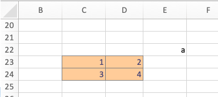

```{r, child = "setup.Rmd", echo=FALSE}
```

```{r include=FALSE}
# use xaringan::inf_mr(cast_from = ".") to preview
```

layout: true

<div class="my-footer">
<span>
<a href="https://bss-osca.github.io/tfa/mod-vba-object-model" target="_blank">Book</a> | <a href="https://bss-osca.github.io/tfa/slides/02-04_vba-object-model-slides.html" target="_blank">Slides</a> | <a href="https://github.com/bss-osca/tfa/blob/master/slides/02-04_vba-object-model-slides.Rmd" target="_blank">Source</a> | <a href="https://github.com/bss-osca/tfa/blob/master/vba/vba-object-model-template.xlsm" target="_blank">Excel</a>
</span>
</div> 

---

## The object model

- The object model is a big hierarchy of all the predefined objects you can use in VBA. Examples of some objects are `Range`, `Worksheet`, and `WorksheetFunction`.
- Think of an object as a datatype that holds a group of variables.
- Objects are grouped and can be nested:

```{r, echo = FALSE, out.width="120%", fig.cap="Object model examples"} 
knitr::include_graphics("./img/object-model.jpg", dpi = 250) 
```

---

## Referring to an object

- You must specify the path in the hierarchy e.g. 
  ```
  Workbooks("Jobs").Worksheets("Data values").Range("D4").value
  ```
- You may skip parts of the path (VBA then uses the current active one):
  ```
  Workbooks("Jobs").Worksheets("Data values").Range("D4").value
  Worksheets("Data values").Range("D4").value
  Range("D4")
  ```
- Warning, you must know which sheet is active. Always specify what you want to be active	
  ```
  Workbooks("Jobs").Worksheets("Data values").Activate  ' activate the sheet
  dbl = Range("D4")
  dbl = SheetData.Range("D4")   ' alternative if the sheet 'Data values' is given 
                                  ' the name SheetData in the VBA editor
  ```

---

## Declaring and setting object variables

- Object variables are declared like any other variables:
  ```
  Dim rng As Range
  Dim wst As Worksheet
  Dim col as Collection
  ```
- Use `Set` to allocate the Object:
  ```
  Set rng = Range("F7")
  Set wst = Worksheets("Data values")
  Set col = Collection
  ```
- You may declare and set in one go using the `New` keyword:
  ```
  Dim col as New Collection  ' col is now an empty collection (0 items)
  ```

Let us try some examples using module `A_ObjectModel` in this [Excel file](https://github.com/bss-osca/tfa/blob/master/vba/vba-object-model-template.xlsm).

---

## The `Range` object

A range represents a cell, a row, a column, or a rectangular selection of cells. 
  ```
  Dim rng As Range
  Set rng = Range("A1:D5")
  rng = 145   ' cell value
  MsgBox rng.Address   ' range address ($A$1:$D$5)
  ```
  
.pull-left[
The current region of a range is found by expanding the range until all cells surrounding the range is empty

  ```
  rng = Range("D23").CurrentRegion
  MsgBox rng.Address  
  ```
This is useful if don't know the size for data.
]
.pull-right[
```{r, echo = FALSE, out.width="120%", fig.cap="What is the current region of D23?"} 
 
```
]

---

## Sorting a range

We can [sort](https://docs.microsoft.com/en-us/office/vba/api/excel.range.sort) the columns in a range. For instance sort a range ascending with respect to the second column and next descending with respect to the first column.
  ```
  rng.Sort Key1:=rng.Columns(2), Order1:=xlAscending, _
           Key2:=rng.Columns(1), Order2:=xlDescending, Header:=xlYes
  ```
Note the way of calling the procedure. You could also write
  ```
  Call rng.Sort(Key1:=rng.Columns(2), Order1:=xlAscending, _
                Key2:=rng.Columns(1), Order2:=xlDescending, Header:=xlYes)
  ```

Let us try some examples using module `B_Ranges` in this [Excel file](https://github.com/bss-osca/tfa/blob/master/vba/vba-object-model-template.xlsm).

---

## The Worksheet object

A `Worksheet` is part of the `Worksheets` collection. You can add a new worksheet using:
  ```
  Dim wst As Worksheet
  Set wst = ThisWorkbook.Worksheets.Add()  ' add new worksheet to collection Worksheets
  wst.Name = "Test3"                       ' set the name
  ```
You can delete a worksheet using:
  ```
  For Each wst In Worksheets
      If wst.Name = "Test3" Then ' Delete "Test3"
          wst.Delete
      End If
  Next
  ```
  
Let us try some examples using module `C_Worksheet` in this [Excel file](https://github.com/bss-osca/tfa/blob/master/vba/vba-object-model-template.xlsm).

  
---

## The Application object

- Can be used to access WorksheetFunctions
- Turn of screen updating while doing calculations
- Turn of automatic updating of cells
- Turn of displaying alerts

Beware this may have some consequences, i.e. always turn these options back to normal when finished calculations.

Let us try some examples using module `D_ApplicationObject` in this [Excel file](https://github.com/bss-osca/tfa/blob/master/vba/vba-object-model-template.xlsm).

---

## The For Each loop

- This [loop](https://docs.microsoft.com/en-us/office/vba/language/reference/user-interface-help/for-eachnext-statement) is used to iterate though objects in a collection:
  ```
  For Each wst In Worksheets
      If wst.Name = "Test3" Then ' Delete "Test3"
          wst.Delete
      End If
  Next
  ```
- You may use an `Exit For` statement to exit the loop:
  ```
  For Each cell In Range("A1:B5") 
      If IsNumeric(cell.Value) = False Then 
        MsgBox "Cell " & cell.Address & " contains a non-numeric value." 
        Exit For 
      End If 
  Next  
  ```


```{r copy to docs, include=FALSE}
file.copy(list.files(pattern = ".html"), "../docs/slides/", overwrite = T)
file.copy("./slides.css", "./libs/", overwrite = T)
file.copy("libs", "../docs/slides/", recursive = T)
file.copy("img", "../docs/slides/", recursive = T)
system2("Rscript", args = "-e 'rmarkdown::render(\"index.Rmd\", quiet = TRUE)'")
```